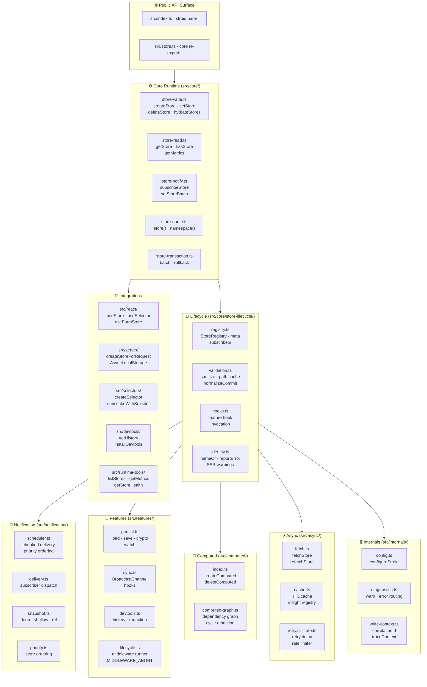
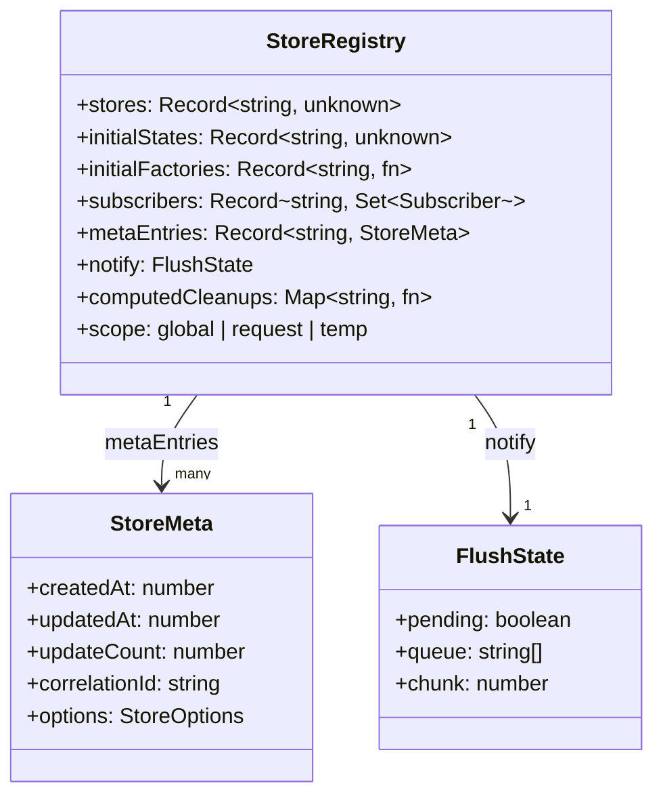
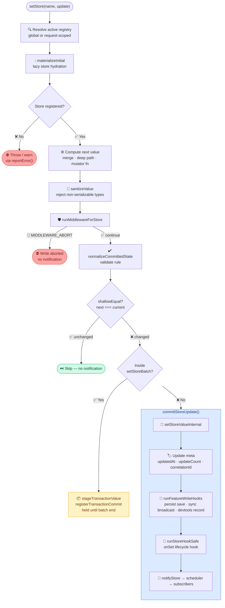
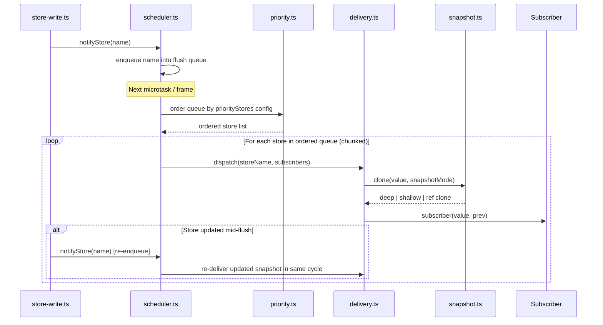
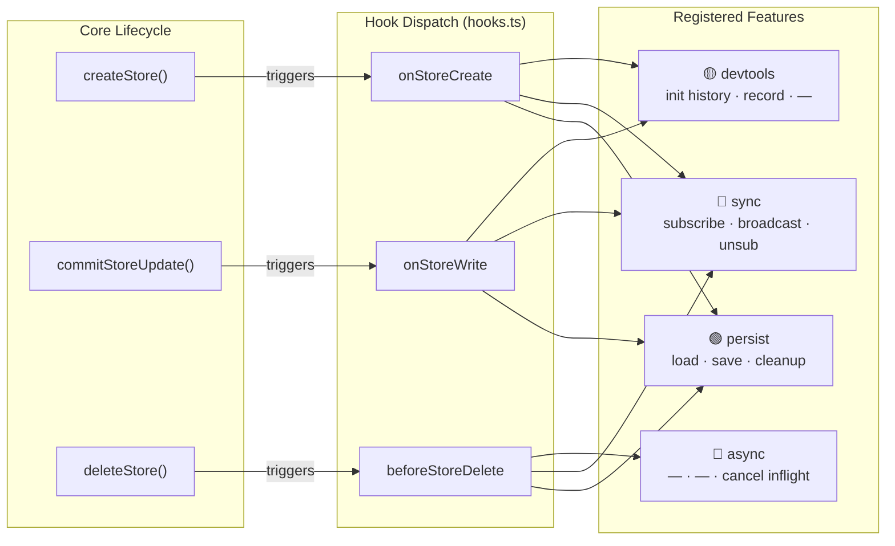
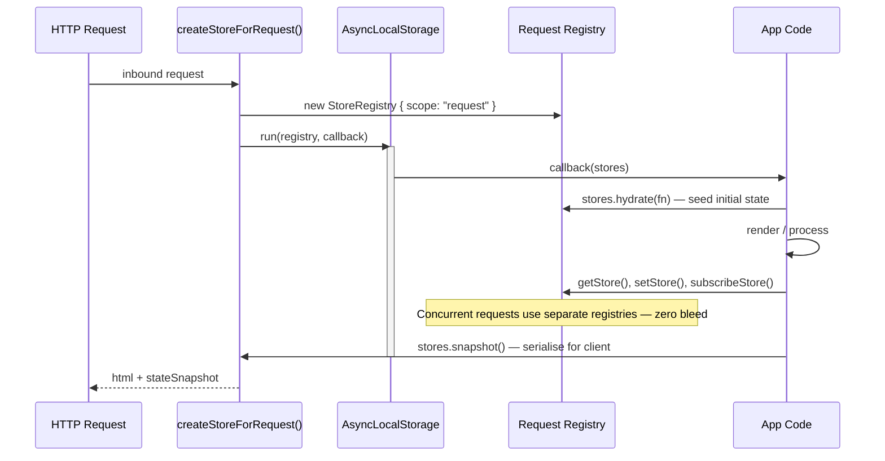
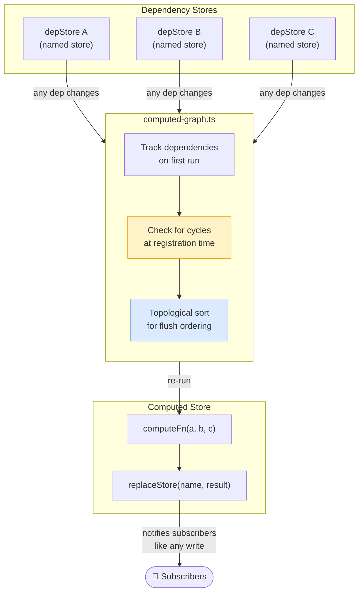
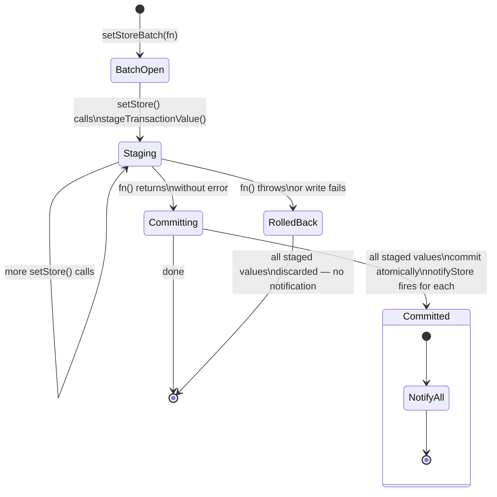
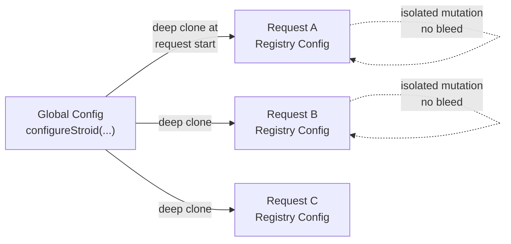

<div align="center">

# 🗂️ Stroid Architecture

[](.)
[](.)
[](.)
[](.)
[](.)

**A named-store state engine — layered, zero-overhead, SSR-safe.**

*Fully audited · Derived from source · Built for contributors*

</div>

---

> [!NOTE]
> **Confidence: HIGH** — all content derived directly from source code structure and module annotations. If something is wrong here, it is wrong in the source.

---

## 📚 Table of Contents

| # | Section | What you'll learn |
|---|---------|-------------------|
| 1 | [Overview](#-overview) | Core design philosophy and naming model |
| 2 | [Layer Stack](#-layer-stack) | How modules are organised from API to internals |
| 3 | [Registry Model](#-registry-model) | The shape of runtime state for any scope |
| 4 | [Write Data Flow](#-write-data-flow) | Every step from `setStore()` to subscriber delivery |
| 5 | [Notification Pipeline](#-notification-pipeline) | Async delivery, priority, chunking, snapshots |
| 6 | [Feature Hook Model](#-feature-hook-model) | How persist / sync / devtools plug in with zero overhead |
| 7 | [SSR Isolation](#-ssr-isolation) | Per-request registry isolation via `AsyncLocalStorage` |
| 8 | [Computed Stores](#-computed-stores) | Derived values, dependency graphs, cycle detection |
| 9 | [Transaction Model](#-transaction-model) | Atomic batch writes and rollback semantics |
| 10 | [Config System](#-config-system) | Registry-scoped config, SSR clone safety |
| 11 | [Versioning](#-versioning) | Release history |

---

## 🧭 Overview

Stroid is a **named-store state engine**. Every store has a string name. That name is its address — used uniformly across every operation:

```
read · write · subscribe · persist · sync · compute · debug
```

> [!TIP]
> Think of the store name as a primary key. Every subsystem — notifications, features, devtools, SSR — addresses stores by name. There are no opaque references.

The system is **strictly layered**:

- A **small, mandatory core** handles reads, writes, subscriptions, and notifications.
- **Optional feature modules** self-register via hooks and add zero runtime overhead to stores that don't use them.
- **Integration layers** (React, SSR, selectors, devtools) sit on top and never reach into core internals.

---

## 🏗️ Layer Stack

The architecture is divided into **eight layers**, from the public API surface down to internal utilities.



<details>
<summary>📋 Full module reference — ASCII tree (click to expand)</summary>

```
┌────────────────────────────────────────────────────────────┐
│ src/index.ts          Public API barrel (stroid)           │
│ src/store.ts          Core runtime re-exports              │
├────────────────────────────────────────────────────────────┤
│ src/core/                                                  │
│   store-write.ts      createStore, setStore, etc.          │
│   store-read.ts       getStore, hasStore, getMetrics       │
│   store-notify.ts     subscribeStore, setStoreBatch        │
│   store-name.ts       store(), namespace()                 │
│   store-transaction.ts  batch/rollback state               │
├────────────────────────────────────────────────────────────┤
│ src/core/store-lifecycle/                                  │
│   registry.ts         StoreRegistry, meta, subscribers     │
│   validation.ts       sanitize, path cache, normalizeCommit│
│   hooks.ts            feature hook invocation              │
│   identity.ts         nameOf, reportError, SSR warnings    │
│   types.ts            StoreDefinition, WriteResult, paths  │
│   bind.ts             feature API binding                  │
├────────────────────────────────────────────────────────────┤
│ src/notification/                                          │
│   scheduler.ts        chunked delivery, priority ordering  │
│   delivery.ts         subscriber dispatch                  │
│   snapshot.ts         snapshot mode handling               │
│   priority.ts         priority store ordering              │
│   metrics.ts          notify timing                        │
├────────────────────────────────────────────────────────────┤
│ src/computed/                                              │
│   index.ts            createComputed, deleteComputed       │
│   computed-graph.ts   dependency graph, cycle detection    │
├────────────────────────────────────────────────────────────┤
│ src/features/                                              │
│   feature-registry.ts registerStoreFeature, hook dispatch  │
│   persist.ts          persistence feature hooks            │
│   persist/            crypto, load, save, watch, types     │
│   sync.ts             BroadcastChannel sync feature hooks  │
│   devtools.ts         history, redaction feature hooks     │
│   lifecycle.ts        MIDDLEWARE_ABORT, middleware runner   │
│   state-helpers.ts    createEntityStore, createCounterStore│
├────────────────────────────────────────────────────────────┤
│ src/async/                                                 │
│   fetch.ts            fetchStore, refetchStore             │
│   cache.ts            TTL cache, inflight registry         │
│   retry.ts            retry delay logic                    │
│   rate.ts             per-store rate limiter               │
│   inflight.ts         dedup / version tracking             │
│   request.ts          buildFetchOptions, parseResponseBody │
│   errors.ts           async usage error routing            │
│   registry.ts         async registry shape                 │
├────────────────────────────────────────────────────────────┤
│ src/selectors/index.ts  createSelector, subscribeWithSelector│
│ src/react/            useStore, useSelector, useFormStore  │
│ src/server/           createStoreForRequest (AsyncLocalStorage)│
│ src/helpers/          createEntityStore, createListStore   │
│ src/devtools/         getHistory, clearHistory, installDevtools│
│ src/runtime-tools/    listStores, getMetrics, getStoreHealth│
│ src/runtime-admin/    clearAllStores, clearStores          │
├────────────────────────────────────────────────────────────┤
│ src/internals/                                             │
│   config.ts           configureStroid, global config state │
│   diagnostics.ts      warn/error routing                   │
│   store-ops.ts        internal store read/write            │
│   store-admin.ts      delete hooks                         │
│   write-context.ts    correlationId / traceContext         │
│   test-reset.ts       deterministic test teardown          │
│   computed-order.ts   topological sort                     │
│   selector-store.ts   selector-facing store access         │
│   hooks-warnings.ts   one-time warning deduplication       │
│   reporting.ts        structured error reporting           │
└────────────────────────────────────────────────────────────┘
```

</details>

---

## 🗄️ Registry Model

A `StoreRegistry` holds **all runtime state** for a given scope — values, snapshots, subscribers, metadata, and scheduler state.



<details>
<summary>🔍 Full registry shape in TypeScript (click to expand)</summary>

```ts
{
  stores:           Record<string, unknown>            // live store values
  initialStates:    Record<string, unknown>            // deep clones at create time
  initialFactories: Record<string, () => unknown>      // lazy factories for deferred hydration
  subscribers:      Record<string, Set<Subscriber>>    // per-store notification sets
  metaEntries:      Record<string, StoreMeta>          // metrics, options, timestamps
  notify:           FlushState                         // scheduler state machine
  computedCleanups: Map<string, () => void>            // teardown functions for computed stores
  scope:            "global" | "request" | "temp"      // registry lifetime type
}
```

</details>

> [!NOTE]
> In SSR, each inbound request gets its own `StoreRegistry` via `AsyncLocalStorage`. The **global registry** is used in browser environments and non-SSR Node processes. Scopes never bleed into one another.

### Scope lifecycle

| Scope | Created by | Lifetime | Shared across requests? |
|-------|-----------|----------|------------------------|
| `"global"` | Module load | Process lifetime | ✅ Yes (browser / Node) |
| `"request"` | `createStoreForRequest()` | Single HTTP request | ❌ No — fully isolated |
| `"temp"` | Internal testing utilities | Test run | ❌ No |

---

## 🔄 Write Data Flow

Every call to `setStore()` passes through a deterministic pipeline before any subscriber is notified.



> [!WARNING]
> Middleware can return `MIDDLEWARE_ABORT` to cancel a write entirely — no value is committed, no subscribers are notified, and no feature hooks run.

> [!TIP]
> The `shallowEqual` check is a deliberate performance gate. If the computed next value is reference-equal (or shallow-equal for objects) to the current value, the entire notification phase is skipped — even inside a batch.

---

## 🔔 Notification Pipeline

After `commitStoreUpdate()` calls `notifyStore()`, control moves entirely into `src/notification/`. Delivery is **always asynchronous** relative to the write.



### Pipeline configuration

| Concern | What it does | Config key | Default |
|---------|-------------|------------|---------|
| **Priority ordering** | Listed stores notify their subscribers first | `flush.priorityStores` | `[]` |
| **Chunked delivery** | Splits subscriber calls across frames to avoid blocking | `flush.chunkSize` | unbounded |
| **Chunk delay** | Gap between chunks in ms | `flush.chunkDelayMs` | `0` |
| **Snapshot mode** | Controls depth of value clone sent to each subscriber | `snapshot` | `"deep"` |
| **Mid-flush re-delivery** | Updated stores re-queued and delivered in same flush cycle | automatic | always on |

> [!WARNING]
> `snapshot: "ref"` skips cloning entirely — subscribers receive the live store reference. Use only when you own all mutation paths and never mutate state you receive in a subscriber.

---

## 🧩 Feature Hook Model

Optional features plug into the core lifecycle via **three hook points**, invoked by `src/core/store-lifecycle/hooks.ts`. Each feature self-registers with `registerStoreFeature()` and is **completely absent from the call path** for stores that don't use it.



### Hook responsibility matrix

| Hook | Fired after… | 🟢 persist | 🔵 sync | 🟡 devtools | 🔴 async |
|------|-------------|-----------|---------|------------|---------|
| `onStoreCreate` | `createStore()` succeeds | Load persisted value | Subscribe to channel | Init history buffer | — |
| `onStoreWrite` | Value committed | Save to storage | Broadcast update | Record history entry | — |
| `beforeStoreDelete` | Before store removed | Cleanup storage key | Unsubscribe channel | — | Cancel inflight |

> [!WARNING]
> If `persist: true` is set on a store but `installPersist()` was never called, Stroid emits a warning. Set `strictMissingFeatures: true` in config to promote this to a thrown error.

<details>
<summary>🔍 How to register a custom feature (click to expand)</summary>

```ts
import { registerStoreFeature } from 'stroid/features';

registerStoreFeature({
  name: 'my-feature',

  onStoreCreate(storeName, registry) {
    // called after every createStore() for stores that opt in
  },

  onStoreWrite(storeName, next, prev, registry) {
    // called after every committed write
  },

  beforeStoreDelete(storeName, registry) {
    // called before deleteStore() removes the store
  },
});
```

</details>

---

## 🌐 SSR Isolation

`createStoreForRequest` (exported from `stroid/server`) creates a fresh `StoreRegistry` for each inbound request and runs the provided async callback inside it using Node's `AsyncLocalStorage`. **Every store operation inside the callback — including nested awaits — resolves to the request-scoped registry.**



### SSR stores API

```ts
const { html, state } = await createStoreForRequest(async (stores) => {

  // 1. Seed server-side state
  await stores.hydrate((set) => {
    set('user',    await fetchUser(req));
    set('session', await fetchSession(req));
  });

  // 2. Render — all store reads resolve to this request's registry
  const html = renderToString(<App />);

  // 3. Serialise state for client hydration
  return { html, state: stores.snapshot() };
});
```

> [!NOTE]
> Concurrent requests **never share** store values, subscribers, or scheduler state. Each `createStoreForRequest` call produces a fully independent registry that is garbage collected when the callback resolves.

---

## 🧮 Computed Stores

Computed stores are regular named stores whose values are **derived** from one or more dependency stores. They are transparent to subscribers — you subscribe to a computed store exactly as you would any other.



Two key guarantees:

| Guarantee | Mechanism |
|-----------|-----------|
| **No circular dependencies** | Cycle detection runs at `createComputed()` call time — throws immediately if a cycle is introduced |
| **Correct flush order** | The notification scheduler topologically sorts stores so dependents always see up-to-date dependency values |

<details>
<summary>🔍 Creating a computed store (click to expand)</summary>

```ts
import { createComputed } from 'stroid/computed';

// Derived from two named dependencies
createComputed('fullName', ['firstName', 'lastName'], (first, last) => {
  return `${first} ${last}`;
});

// Subscribe exactly as with any other store
subscribeStore('fullName', (value) => {
  console.log('Full name changed:', value);
});
```

</details>

---

## 📦 Transaction Model

`setStoreBatch(fn)` provides **atomic multi-store writes**. All `setStore()` calls inside the batch are staged rather than committed immediately. They either all commit or all roll back.



> [!WARNING]
> **Disallowed inside a batch:** `createStore`, `deleteStore`, and `hydrateStores` will throw (or warn, depending on config) if called while a batch is open. Stores must exist before the batch begins.

<details>
<summary>🔍 Batch usage example (click to expand)</summary>

```ts
import { setStoreBatch } from 'stroid';

// All three writes commit atomically, or none do
setStoreBatch(() => {
  setStore('cart',   addItem(getStore('cart'), newItem));
  setStore('total',  recalculate());
  setStore('synced', false);
});

// Subscribers for cart, total, and synced all fire after the batch commits
```

</details>

---

## ⚙️ Config System

`configureStroid(config)` is **registry-scoped**, not process-global. In SSR, each request registry receives a **deep clone** of the global config so that per-request adjustments cannot bleed into adjacent requests.

```ts
configureStroid({
  // Notification tuning
  flush: {
    priorityStores: ['auth', 'session'],  // these notify subscribers first
    chunkSize:      20,                   // subscribers per delivery chunk
    chunkDelayMs:   4,                    // ms gap between chunks
  },

  // Default snapshot mode for all stores (overridable per store)
  snapshot: 'deep',                       // "deep" | "shallow" | "ref"

  // Feature safety
  strictMissingFeatures: true,            // throw instead of warn on missing features
});
```

### Config inheritance in SSR



> [!NOTE]
> The global config acts as a **baseline template**. Each request registry can mutate its local clone freely — changing log levels, toggling middleware — without affecting any other request or the global default.

---

## 🏷️ Versioning

<div align="center">

| Field | Value |
|-------|-------|
| **Version** | `1.0.0` |
| **Released** | March 2026 |
| **Scope** | Core runtime · Registry isolation · Computed stores · SSR request scoping · Feature hook model · Async fetch layer · Transaction batch / rollback |
| **Changelog** | [CHANGELOG.md](./CHANGELOG.md) |

</div>

---

<div align="center">

*Architecture document maintained by the Stroid core team.*
*Open a PR to propose corrections — all claims are verifiable against source.*

</div>