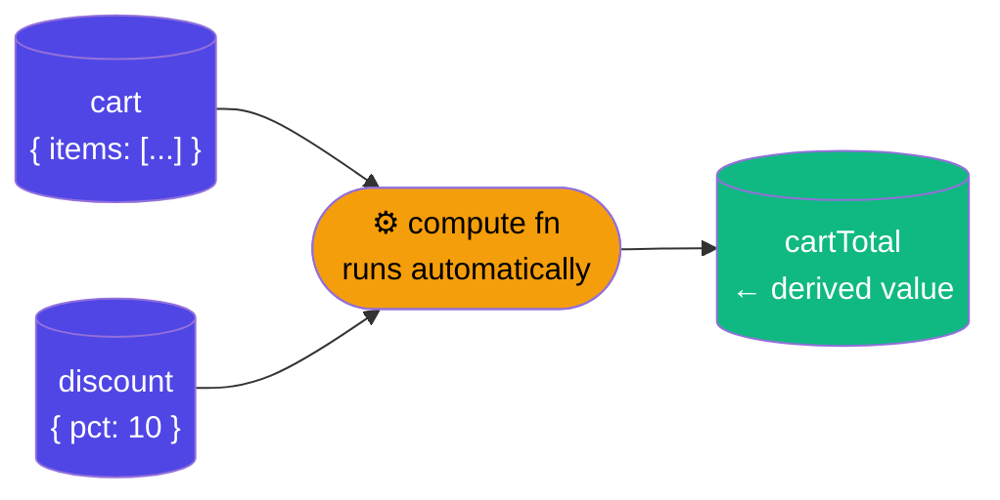
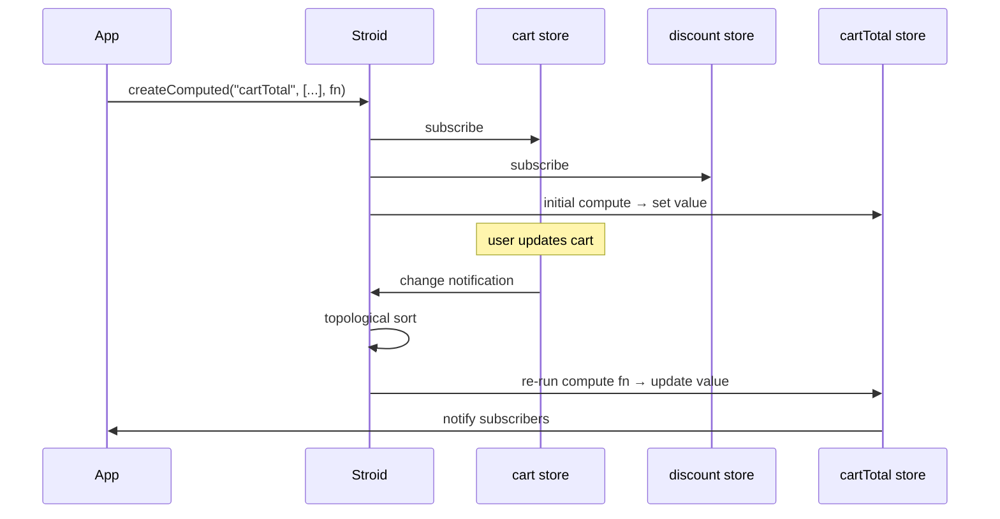
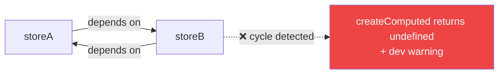
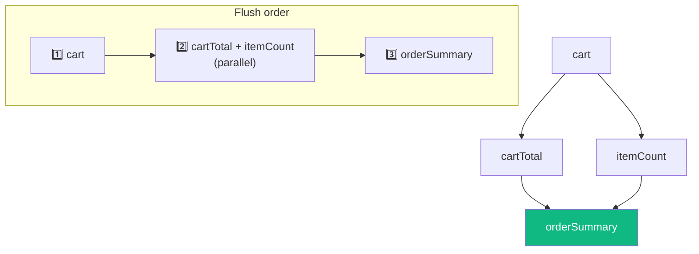
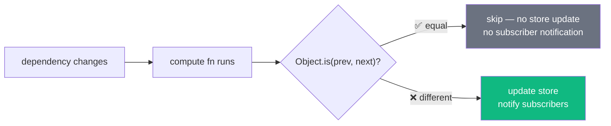
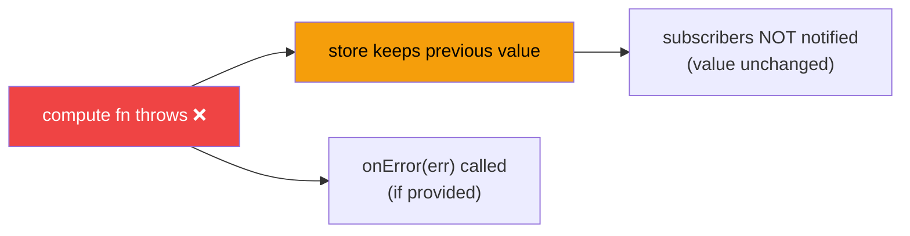
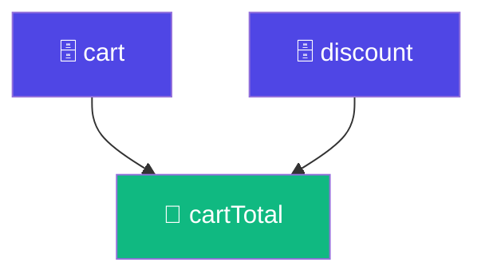

# 🧮 Computed Stores

> **Version:** 1.0 &nbsp;|&nbsp; **Last Updated:** 2026-03-29 &nbsp;|&nbsp; **Confidence:** 
>
> *Derived from `src/computed/index.ts`, `src/computed/computed-graph.ts`*

---

## 📚 Table of Contents

- [What Is a Computed Store?](#-what-is-a-computed-store)
- [Setup](#-setup)
- [Basic Usage](#-basic-usage)
- [Dependencies](#-dependencies)
- [Cycle Detection](#-cycle-detection)
- [Flush Ordering](#-flush-ordering)
- [Skipping No-Op Updates](#-skipping-no-op-updates)
- [Error Handling](#-error-handling)
- [API Reference](#-api-reference)
  - [invalidateComputed](#invalidatecomputedname)
  - [deleteComputed](#deletecomputedname)
  - [isComputedStore](#iscomputedstorename)
- [Observability](#-observability)

---

## 💡 What Is a Computed Store?

A **computed store** is a store whose value is automatically derived from one or more **dependency stores**. Whenever any dependency changes, the compute function re-runs and the computed store's value updates — reactively, with no manual wiring.



> [!NOTE]
> Under the hood, a computed store is a regular store managed by `replaceStore`. This means you can read it with `getStore`, subscribe with `useStore`, and even chain it as a dependency for *other* computed stores — no special treatment needed.

<details>
<summary>🧠 <strong>Why computed stores, not derived selectors?</strong></summary>

Many state libraries offer "selectors" — pure functions you call at read time to derive values. Computed stores take a different approach: they're **eagerly evaluated and cached** as real stores. This means:

- Subscribers are notified only when the computed value actually changes (not on every render)
- Other computed stores can declare them as dependencies, enabling **deep derivation graphs**
- You can use `getStore("cartTotal")` in non-reactive contexts (e.g. server actions) without a React hook

The trade-off: computed stores have a small up-front registration cost and hold memory for their lifetime. For very cheap, read-heavy derivations you may prefer a plain selector function. For anything with real logic or downstream subscribers, a computed store is the right tool.

</details>

---

## ⚙️ Setup

```ts
import { createComputed } from "stroid/computed"
```

> [!TIP]
> No side-effect import is required. Unlike sync or persist, `createComputed` needs no `install*()` call — import it and use it directly.

---

## 🚀 Basic Usage

```ts
import { createStore }    from "stroid"
import { createComputed } from "stroid/computed"

createStore("cart",     { items: [] })
createStore("discount", { pct: 10 })

createComputed(
  "cartTotal",           // ← name of the new computed store
  ["cart", "discount"],  // ← dependency store names
  (cart, discount) => {  // ← compute function, args match dep order
    const raw = cart.items.reduce((sum, i) => sum + i.price, 0)
    return raw * (1 - discount.pct / 100)
  }
)

// cartTotal is now a regular store — use it anywhere:
getStore("cartTotal")  // → computed value (non-reactive)
useStore("cartTotal")  // → reactive in React components
```

**What happens step by step:**



---

## 🔗 Dependencies

Dependencies can be declared as **store name strings**, `StoreDefinition` handles, or `StoreKey` handles — or any mix of the two:

```ts
const cartStore = store<"cart", CartState>("cart")

createComputed(
  "cartTotal",
  [cartStore, "discount"],  // ✅ mix of handle and string
  (cart, discount) => { ... }
)
```

> [!NOTE]
> The compute function receives dependency values **in the same order** as the dependency array. TypeScript will infer argument types when using `StoreDefinition` handles.

### Missing Dependencies

| Scenario | Behaviour |
|---|---|
| Dependency store **not yet created** at registration time | Argument receives `null`; dev warning emitted |
| Dependency store **created later** | Computed store picks it up automatically — no re-registration needed |
| Dependency store **deleted** | Argument drops back to `null`; compute re-runs |

> [!WARNING]
> If a dependency receives `null`, your compute function must handle it — otherwise it will throw on first evaluation. Use `onError` to catch this gracefully during development.

```ts
// ✅ Guard against null dependencies
(cart, discount) => {
  if (!cart || !discount) return 0
  const raw = cart.items.reduce((sum, i) => sum + i.price, 0)
  return raw * (1 - discount.pct / 100)
}
```

---

## 🔄 Cycle Detection

Circular dependencies are caught **at registration time** — not at runtime.



```ts
createComputed("a", ["b"], (b) => b.value + 1)
createComputed("b", ["a"], (a) => a.value + 1)
// ⚠️ Warning: Circular dependency detected: b → a → b
// returns undefined
```

> [!WARNING]
> `createComputed` returns `undefined` when a cycle is detected. If you store the return value for later use (e.g. to pass as a `StoreDefinition` handle), always null-check it.

---

## 📊 Flush Ordering

When multiple computed stores depend on each other, Stroid **topologically sorts** the update order to guarantee each computed store sees fresh upstream values before it runs.



<details>
<summary>🧠 <strong>Why this matters for complex derivation graphs</strong></summary>

Without topological ordering, a naïve implementation might notify `orderSummary` before `cartTotal` has finished updating, causing it to compute with a stale intermediate value — a classic **glitch** in reactive systems.

Stroid's flush pipeline eliminates glitches by processing nodes in dependency-depth order. Nodes at the same depth (no ordering dependency between them, e.g. `cartTotal` and `itemCount` above) are safe to flush in parallel.

This is especially important in graphs with **diamond dependencies** (two paths from one source to one destination), which are common in real apps.

</details>

---

## ⚡ Skipping No-Op Updates

If the compute function returns a value that is **`Object.is`-equal** to the previous computed value, the store is **not updated** and subscribers are **not notified**.



> [!TIP]
> This means compute functions that return **primitives** (`string`, `number`, `boolean`) get memoization for free. For object/array returns, a new reference always triggers a notification — consider returning a stable reference or a primitive summary (e.g. a count or total) if subscribers are expensive to re-render.

<details>
<summary>🧠 <strong>Object identity and performance</strong></summary>

```ts
// ⚠️ Always notifies — new array reference every time
(cart) => cart.items.filter(i => i.inStock)

// ✅ Only notifies when the count actually changes
(cart) => cart.items.filter(i => i.inStock).length

// ✅ Stable reference if content hasn't changed (manual memoization)
let prev: Item[] = []
(cart) => {
  const next = cart.items.filter(i => i.inStock)
  if (next.length === prev.length && next.every((x, i) => x === prev[i])) return prev
  return (prev = next)
}
```

For most apps the first pattern is fine. Optimize only when profiling shows subscriber churn.

</details>

---

## 🛡 Error Handling

If the compute function throws, the store **retains its previous value** — it does not go into an error state or become `undefined`. Provide `onError` to observe and report failures:

```ts
createComputed(
  "cartTotal",
  ["cart", "discount"],
  (cart, discount) => {
    // if this throws...
    return cart.items.reduce((sum, i) => sum + i.price, 0) * (1 - discount.pct / 100)
  },
  {
    onError: (err) => {
      console.error("cartTotal compute failed", err)
      Sentry.captureException(err)
    }
  }
)
```



> [!WARNING]
> Silent error retention means a broken compute function won't crash your UI — but your store may silently serve stale data. Always wire up `onError` in production and alert on unexpected compute failures.

> [!TIP]
> During development, consider throwing from `onError` after logging — this makes compute failures loud and obvious rather than silently swallowed.

---

## 📖 API Reference

### `invalidateComputed(name)`

Forces an **immediate re-run** of the compute function, regardless of whether any dependency has changed.

```ts
import { invalidateComputed } from "stroid/computed"

invalidateComputed("cartTotal")
```

<details>
<summary>🧠 <strong>When would you need this?</strong></summary>

Computed stores track changes through dependency subscriptions — so if your compute function reads data from **outside** the dependency graph (e.g. `Date.now()`, `Math.random()`, a module-level cache, or an external singleton), Stroid has no way to know when that external data changes.

`invalidateComputed` is your escape hatch:

```ts
// Compute function reads from an external cache (not a Stroid store)
createComputed("exchangeRates", ["cart"], (cart) => {
  return cart.items.map(i => i.price * externalRateCache.get(i.currency))
})

// When the external cache updates, manually invalidate:
externalRateCache.on("update", () => invalidateComputed("exchangeRates"))
```

</details>

---

### `deleteComputed(name)`

Unsubscribes from all dependency stores and **removes** the computed store entirely.

```ts
import { deleteComputed } from "stroid/computed"

deleteComputed("cartTotal")
```

> [!NOTE]
> After deletion, any stores that depended on `"cartTotal"` as a dependency will receive `null` for that argument on their next compute run.

> [!TIP]
> Use `deleteComputed` in cleanup logic for feature flags, A/B tests, or dynamically scoped stores — for example, deleting a per-session computed store when the user logs out.

---

### `isComputedStore(name)`

Returns `true` if the given store name belongs to a computed store.

```ts
import { isComputedStore } from "stroid/computed"

isComputedStore("cartTotal")  // → true
isComputedStore("cart")       // → false
```

> [!TIP]
> Useful in generic middleware or devtools that need to distinguish between writable and derived stores — for example, to prevent direct writes to a computed store.

---

## 🔭 Observability

Inspect the full computed dependency graph at runtime using the runtime-tools package:

```ts
import { getComputedGraph, getComputedDeps } from "stroid/runtime-tools"

getComputedGraph()
// {
//   nodes: ["cartTotal"],
//   edges: [
//     { from: "cart",     to: "cartTotal" },
//     { from: "discount", to: "cartTotal" }
//   ]
// }

getComputedDeps("cartTotal")
// → ["cart", "discount"]
```

**Visualised graph output for the cart example:**



<details>
<summary>🧠 <strong>Building a devtools inspector with getComputedGraph</strong></summary>

`getComputedGraph()` returns a plain `{ nodes, edges }` object — exactly the shape consumed by graph visualisation libraries like `d3-dag`, `dagre`, or `react-flow`. In a devtools panel you can pipe this directly to a renderer to get a live dependency graph:

```ts
// Example: render with react-flow
const { nodes, edges } = getComputedGraph()

const rfNodes = nodes.map(n => ({ id: n, data: { label: n }, position: { x: 0, y: 0 } }))
const rfEdges = edges.map(e => ({ id: `${e.from}-${e.to}`, source: e.from, target: e.to }))
```

Pair this with a `subscribeAll` hook to re-render the graph on every store change for a fully live dependency inspector.

</details>

---

*© Stroid Docs — Generated 2026-03-29*