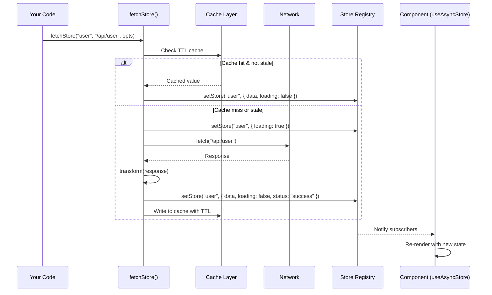
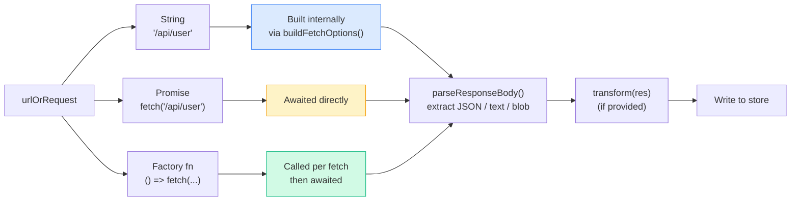
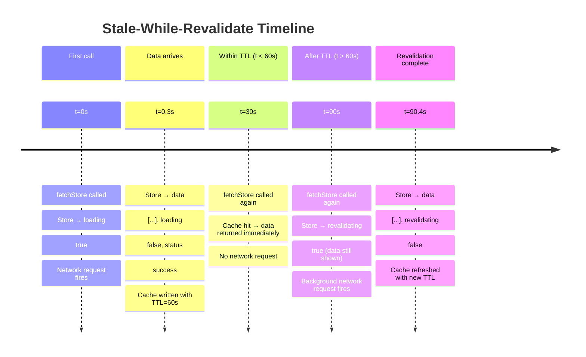
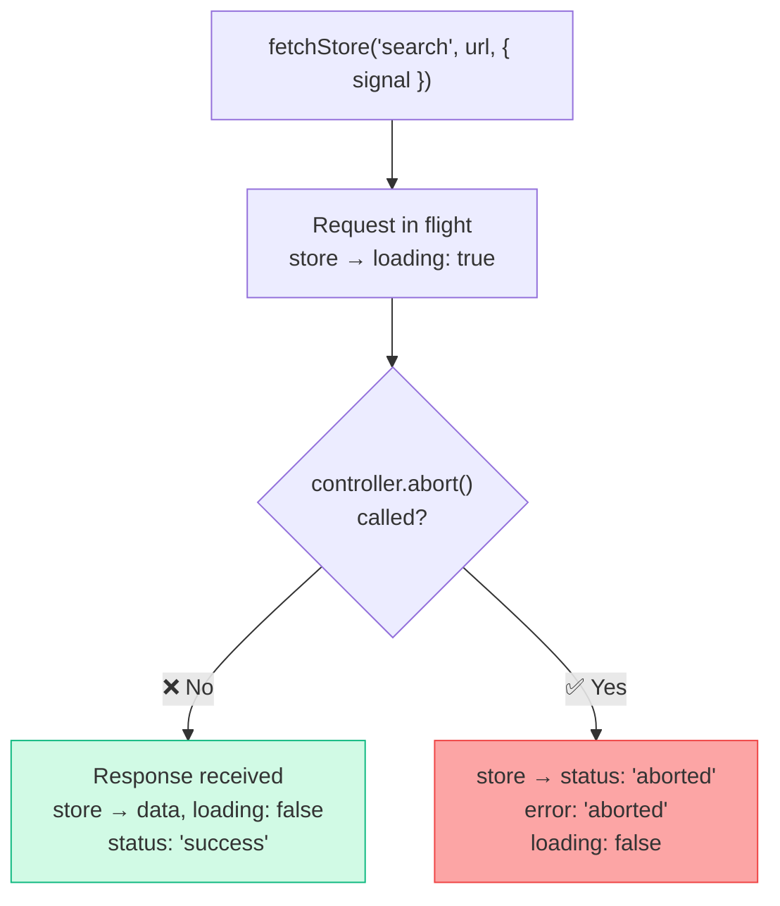
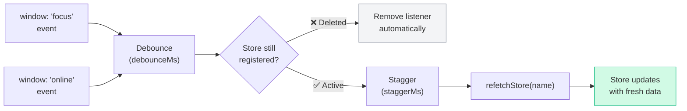
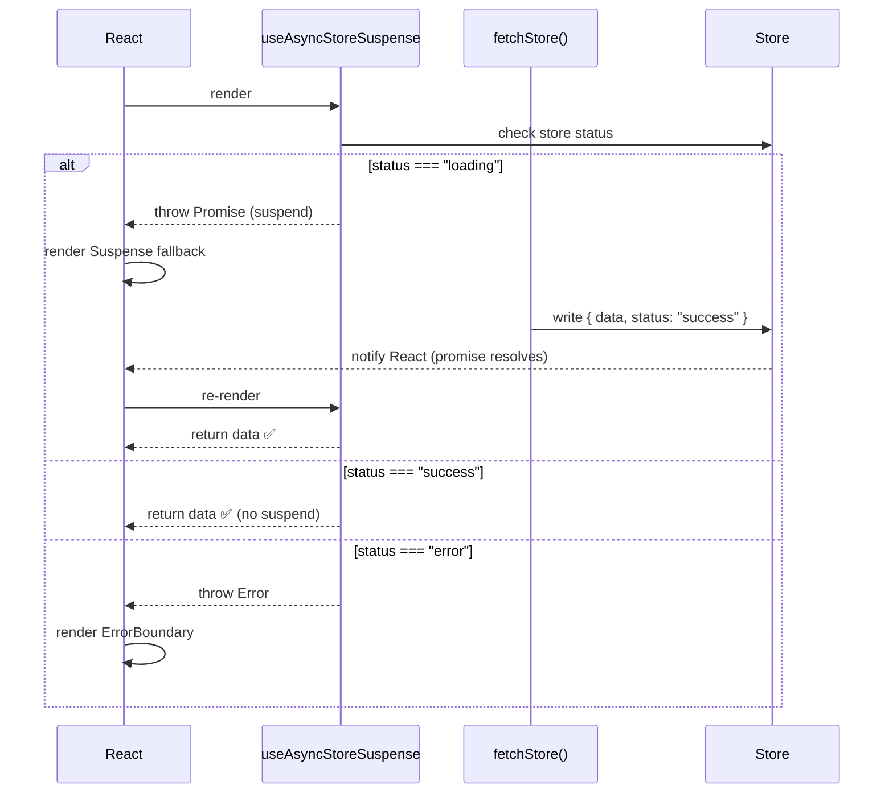
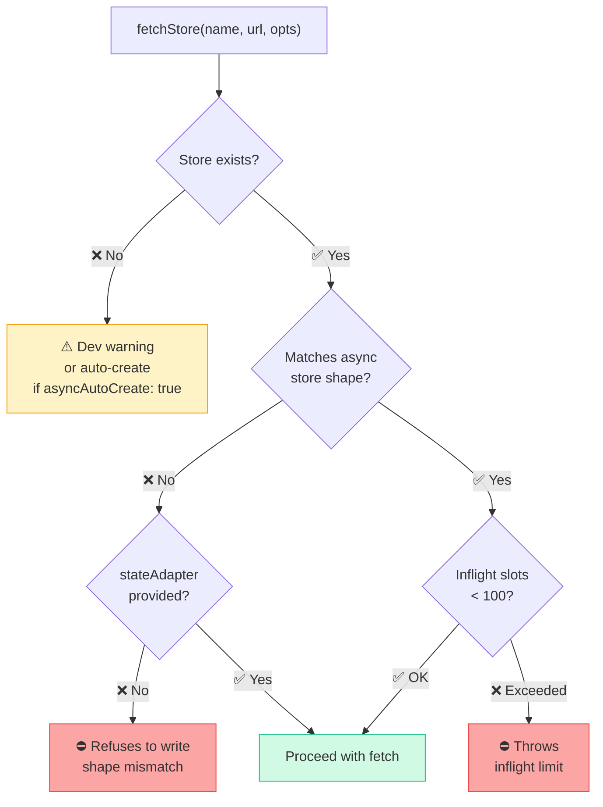
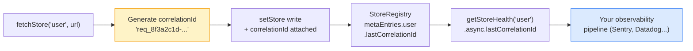

<div align="center">

# ⚡ Async Layer Guide

[](.)
[](.)
[](.)
[](.)

**Async data fetching, caching, deduplication, and revalidation — built on top of named stores.**

</div>

---

> [!NOTE]
> **Confidence: HIGH** — derived from `src/async/fetch.ts`, `src/async/cache.ts`, `src/react/hooks-async.ts`.

---

## 📚 Table of Contents

| # | Section | Topics |
|---|---------|--------|
| 1 | [How It Works](#-how-it-works) | Mental model, async state shape, store setup |
| 2 | [Setup](#-setup) | Import paths, no side-effect registration needed |
| 3 | [Basic Usage](#-basic-usage) | `fetchStore`, `useAsyncStore`, reading async state |
| 4 | [`fetchStore` Options](#-fetchstore-options) | Full options reference — caching, request, reliability |
| 5 | [Input Types](#-input-types) | URL string, Promise, factory function |
| 6 | [Stale-While-Revalidate](#-stale-while-revalidate) | Background refresh, `revalidating` flag |
| 7 | [Abort Control](#-abort-control) | `AbortController`, `signal`, abort state |
| 8 | [`refetchStore`](#-refetchstore) | Replay last fetch recipe for a store |
| 9 | [`enableRevalidateOnFocus`](#-enablerevalidateonfocus) | Focus / online revalidation, global config |
| 10 | [`getAsyncMetrics`](#-getasyncmetrics) | Global counters and per-store async metrics |
| 11 | [Suspense Integration](#-suspense-integration-useasyncstoresuspense) | `useAsyncStoreSuspense`, promise reuse |
| 12 | [Limits & Safeguards](#-limits--safeguards) | Slots, rate limiting, dedup, auto-create |
| 13 | [Correlation IDs & Tracing](#-correlation-ids--tracing) | `autoCorrelationIds`, `getStoreHealth` |

---

## 🧭 How It Works

`fetchStore` writes async lifecycle state into a **regular named store**. Your components read from that store using `useStore` or `useAsyncStore` — there is no separate state machine and no async-specific hook API to learn.



> [!TIP]
> The async layer is just a **write engine on top of named stores**. Everything you already know about `getStore`, `subscribeStore`, middleware, and devtools applies to async stores — no new mental model required.

### Required store shape

The target store must exist and match this shape before `fetchStore` is called:

```ts
createStore("user", {
  data:    null,     // the fetched payload — null until first success
  loading: false,    // true while a request is in flight
  error:   null,     // error message string or null
  status:  "idle",   // "idle" | "loading" | "success" | "error" | "aborted"
})
```

`fetchStore` manages these fields automatically on every lifecycle transition.

---

## 🔧 Setup

```ts
import { fetchStore, refetchStore, enableRevalidateOnFocus } from "stroid/async"
```

> [!NOTE]
> `stroid/async` is a **regular module** — no side-effect import or install call required. This is different from optional features like `stroid/persist`, `stroid/sync`, and `stroid/devtools`, which require explicit registration:

```ts
// These DO require explicit registration:
import { installPersist }  from "stroid/persist"
import { installSync }     from "stroid/sync"
import { installDevtools } from "stroid/devtools"

installPersist()   // ← required once at app startup
installSync()
installDevtools()

// stroid/async does NOT need this — just import and call.
```

---

## 🚀 Basic Usage

### Fetching data

```ts
import { fetchStore } from "stroid/async"

fetchStore("user", "/api/user", {
  ttl:    30_000,  // cache result for 30 seconds
  dedupe: true,    // concurrent calls share one in-flight request (default: true)
})
```

### Reading async state in a component

```tsx
import { useAsyncStore } from "stroid/react"

function UserCard() {
  const { data, loading, error, isEmpty } = useAsyncStore("user")

  if (loading) return <Spinner />
  if (error)   return <ErrorMessage text={error} />
  if (isEmpty) return <EmptyState />

  return <div>{data.name}</div>
}
```

### Async store state fields

| Field | Type | Description |
|-------|------|-------------|
| `data` | `T \| null` | The last successfully fetched payload |
| `loading` | `boolean` | `true` while a request is in flight |
| `error` | `string \| null` | Error message from last failed request |
| `status` | `string` | `"idle"` · `"loading"` · `"success"` · `"error"` · `"aborted"` |
| `isEmpty` | `boolean` | `true` when `data == null && !loading && !error` |
| `revalidating` | `boolean` | `true` during background SWR re-fetch (data is still shown) |

---

## 🗂️ `fetchStore` Options

### Full options reference

```ts
fetchStore("user", "/api/user", {

  // ─── Caching ────────────────────────────────────────────────
  ttl:                  30_000,     // ms — how long before data is considered stale
  staleWhileRevalidate: true,       // show stale data while re-fetching in background

  // ─── Request ─────────────────────────────────────────────────
  method:   "GET",
  headers:  { Authorization: `Bearer ${token}` },
  body:     JSON.stringify(payload),
  signal:   controller.signal,      // AbortController — cancel the request

  // ─── Response handling ────────────────────────────────────────
  transform:  (res)  => res.data,   // reshape the response before writing to store
  onSuccess:  (data) => console.log("fetched:", data),
  onError:    (err)  => Sentry.captureException(err),

  // ─── Reliability ─────────────────────────────────────────────
  retry:       3,                   // number of retries on failure
  retryDelay:  400,                 // ms between retries

  // ─── Deduplication ───────────────────────────────────────────
  dedupe:      true,                // default: true — concurrent calls share one request

  // ─── Custom state update ──────────────────────────────────────
  stateAdapter: ({ name, prev, next, set }) => {
    set({ ...prev, data: next.data, loading: false })
  },
})
```

<details>
<summary>🧠 Senior note: stateAdapter — when and why (click to expand)</summary>

`stateAdapter` gives you full control over how the async result is written back to the store. Use it when:

- Your store shape doesn't match the default `{ data, loading, error, status }` convention.
- You need to **merge** fetched data into an existing structure (e.g. pagination — append to a list instead of replacing it).
- You want to write to **multiple stores** as a side effect of one fetch.

```ts
// Pagination example — append results instead of replacing
fetchStore("posts", `/api/posts?page=${page}`, {
  stateAdapter: ({ prev, next, set }) => {
    set({
      ...prev,
      data:    [...(prev.data ?? []), ...next.data],  // append new page
      loading: false,
      page,
    })
  },
})
```

</details>

### Options quick reference

| Option | Type | Default | Purpose |
|--------|------|---------|---------|
| `ttl` | `number` (ms) | `0` (no cache) | How long fetched data stays fresh |
| `staleWhileRevalidate` | `boolean` | `false` | Show stale data while re-fetching |
| `method` | `string` | `"GET"` | HTTP method |
| `headers` | `Record<string, string>` | `{}` | Request headers |
| `body` | `string \| FormData` | — | Request body |
| `signal` | `AbortSignal` | — | Cancellation signal |
| `transform` | `(res) => T` | identity | Reshape response before writing |
| `onSuccess` | `(data) => void` | — | Callback after successful write |
| `onError` | `(err) => void` | — | Callback on failure |
| `retry` | `number` | `0` | Retry attempts on network failure |
| `retryDelay` | `number` (ms) | `400` | Delay between retries |
| `dedupe` | `boolean` | `true` | Share one in-flight request across concurrent callers |
| `stateAdapter` | `fn` | — | Custom state merge logic |

---

## 🔗 Input Types

The second argument to `fetchStore` (`urlOrRequest`) accepts three forms:

```ts
// 1. URL string — most common
fetchStore("user", "/api/user", opts)

// 2. Promise — pass a pre-built fetch promise
fetchStore("user", fetch("/api/user"), opts)

// 3. Factory function — called lazily per request (useful for dynamic URLs)
fetchStore("user", () => fetch(`/api/user?t=${Date.now()}`), opts)
```



> [!TIP]
> Use the **factory form** when you need a fresh request on every call — for example, when the URL includes a timestamp, nonce, or user-specific parameter that changes between invocations.

> [!WARNING]
> Direct Promise inputs are awaited as-is. Because Stroid cannot recreate the Promise, retry settings do not apply and `refetchStore()` can only fall back to the most recent cached value. Use a URL string or factory when you need retries, backoff, or replayable refetches.

---

## 🔄 Stale-While-Revalidate

SWR allows your UI to show **cached data immediately** while Stroid quietly re-fetches in the background.

```ts
fetchStore("posts", "/api/posts", {
  ttl:                  60_000,  // data is fresh for 60 seconds
  staleWhileRevalidate: true,    // after TTL, show stale + background refresh
})
```



### State during SWR revalidation

| Field | During initial load | During SWR revalidation |
|-------|--------------------|-----------------------|
| `data` | `null` | Previous cached value ✅ |
| `loading` | `true` | `false` |
| `revalidating` | `false` | `true` |
| `status` | `"loading"` | `"success"` (still showing stale) |

> [!TIP]
> Show a subtle "Refreshing…" indicator when `revalidating === true` rather than a full spinner. The user already has data to look at — a full loading state would be jarring.

---

## 🛑 Abort Control

Pass an `AbortController` signal to cancel an in-flight request. The store is updated immediately when the request is aborted.

```ts
const controller = new AbortController()

fetchStore("search", `/api/search?q=${query}`, {
  signal: controller.signal,
})

// Cancel the request at any time:
controller.abort()
// Store immediately → { status: "aborted", error: "aborted", loading: false }
```



> [!TIP]
> In React, create a new `AbortController` per effect and call `controller.abort()` in the cleanup function. This prevents stale responses from writing to the store after a component unmounts or a dependency changes.

<details>
<summary>🔍 React abort pattern with useEffect (click to expand)</summary>

```tsx
useEffect(() => {
  const controller = new AbortController()

  fetchStore("search", `/api/search?q=${query}`, {
    signal: controller.signal,
    dedupe: false,  // each keystroke is a distinct request
  })

  return () => controller.abort()  // cancel on query change or unmount
}, [query])
```

</details>

---

## 🔁 `refetchStore`

Replays the last fetch recipe for a store (same URL/factory + options).

```ts
import { fetchStore, refetchStore } from "stroid/async"

// Register a replayable recipe first.
await fetchStore("user", "/api/user", { ttl: 30_000 })

// Replay the last recipe.
refetchStore("user")
```

| | `fetchStore` | `refetchStore` |
|---|---|---|
| Respects TTL cache | ✅ Yes | ✅ Reuses original options (including `ttl`) |
| Accepts full options | ✅ Yes | ❌ Replays the previous recipe; no new options |
| Use when… | Initial load or cache-aware fetch | Repeat the same request later |

> [!TIP]
> If you need a guaranteed network hit after a mutation, call `fetchStore(..., { ttl: 0 })` or change the `cacheKey`.

---

## 👁️ `enableRevalidateOnFocus`

Automatically re-fetches a store when the page **regains focus** (tab switch back) or comes back **online** (network reconnect).

```ts
import { fetchStore, enableRevalidateOnFocus } from "stroid/async"

// Register a replayable fetch recipe first.
await fetchStore("user", "/api/user", { ttl: 30_000 })

const stopAutoRefresh = enableRevalidateOnFocus("user", {
  debounceMs: 500,
  maxConcurrent: 5,
  staggerMs: 100,
})
```

Focus listeners are automatically removed when the store is deleted — no manual cleanup needed.

### Global configuration

```ts
configureStroid({
  revalidateOnFocus: {
    debounceMs:   500,   // minimum ms between revalidations (prevents rapid fire)
    maxConcurrent: 5,    // max stores revalidating simultaneously
    staggerMs:    100,   // stagger start times across concurrent revalidations
  }
})
```



> [!NOTE]
> `debounceMs` is critical in tabbed apps. Without it, switching between tabs rapidly could fire dozens of revalidations. The default debounce prevents this while still ensuring data is fresh when the user actually returns to focus.

---

## 📊 `getAsyncMetrics`

Use `getAsyncMetrics()` to inspect async performance counters.

```ts
import { getAsyncMetrics } from "stroid/async"

// Global counters across all async stores
const global = getAsyncMetrics()

// Optional per-store counters
const user = getAsyncMetrics("user")
```

Returned fields:

- `cacheHits`
- `cacheMisses`
- `dedupes`
- `requests`
- `failures`
- `avgMs`
- `lastMs`

If a store has no async activity yet, `getAsyncMetrics("storeName")` returns `null`.
Per-store metrics are removed automatically when that store is deleted.

---

## ⏳ Suspense Integration — `useAsyncStoreSuspense`

For React Suspense, `useAsyncStoreSuspense` **throws a promise** while loading and resolves directly to the `data` field when the fetch completes — no `loading` flag needed.

```tsx
import { useAsyncStoreSuspense } from "stroid/react"

// ✅ Must be wrapped in <React.Suspense>
function UserProfile() {
  const user = useAsyncStoreSuspense("user", "/api/user", {
    ttl: 30_000,
    autoCreate: true,
  })
  //    ^^^^
  //    Directly typed as the data value — no null check needed here
  return <div>{user.name}</div>
}

// In your layout:
<React.Suspense fallback={<Spinner />}>
  <ErrorBoundary>
    <UserProfile />
  </ErrorBoundary>
</React.Suspense>
```



> [!NOTE]
> `useAsyncStoreSuspense` **reuses in-flight promises** across concurrent renders. If React renders a component tree multiple times before the fetch resolves (Concurrent Mode), only one network request fires — the same promise is thrown and caught each time.

> [!WARNING]
> Always pair `useAsyncStoreSuspense` with both a `<React.Suspense>` boundary (for loading) **and** an `<ErrorBoundary>` (for errors). Without an ErrorBoundary, a failed fetch will throw an uncaught error and crash the React tree.

---

## 🔒 Limits & Safeguards

Stroid's async layer has built-in guards to prevent runaway fetches, memory leaks, and silent misconfiguration.



### Limits reference

| Limit | Value | Behaviour when exceeded |
|-------|-------|------------------------|
| Inflight slots per store | 100 | Throws immediately |
| Cache slots per store | 100 | Oldest entry evicted |
| Rate limiting | Per-store (built-in) | Requests throttled; metadata pruned on store deletion |

### Config safeguards

| Behaviour | Default | How to change |
|-----------|---------|---------------|
| Warn when store doesn't exist | ✅ Warn in dev | `configureStroid({ asyncAutoCreate: true })` to auto-create |
| Refuse to write to non-async shape stores | ✅ Refuse | Provide a `stateAdapter` to override |
| Concurrent `fetchStore` calls | Deduped (one request) | Set `dedupe: false` to allow parallel requests |

> [!WARNING]
> By default, `fetchStore` **refuses to write** to stores that don't match the expected async shape (`{ data, loading, error, status }`). This prevents accidental corruption of non-async stores. If you need a custom shape, always provide a `stateAdapter`.

> [!TIP]
> Set `configureStroid({ asyncAutoCreate: true })` during development to reduce boilerplate — Stroid will create missing stores on first fetch. Disable this in production for strict store discipline.

---

## 🔬 Correlation IDs & Tracing

Enable automatic correlation IDs to trace async writes through your observability pipeline:

```ts
configureStroid({ autoCorrelationIds: true })
```

When enabled, each `fetchStore` call attaches a unique correlation ID and optional trace context to the write operation. These are visible in store health diagnostics:

```ts
import { getStoreHealth } from "stroid/runtime-tools"

const health = getStoreHealth("user")

console.log(health.async.lastCorrelationId)
// → "req_8f3a2c1d-..."

console.log(health.async.lastTraceContext)
// → { traceId: "...", spanId: "...", ... }
```



> [!TIP]
> **Senior note:** Correlation IDs let you correlate a UI state update with the exact network request that produced it — invaluable when debugging race conditions, stale responses, or unexpected store writes in distributed traces. Forward the correlation ID as a request header (`X-Correlation-ID`) to correlate with server-side logs.

<details>
<summary>🔍 Forwarding correlationId as a request header (click to expand)</summary>

```ts
import { getStoreHealth } from "stroid/runtime-tools"

// Generate the correlation ID before the fetch by reading the current one,
// or pass it explicitly via headers:
fetchStore("user", "/api/user", {
  headers: {
    "X-Correlation-ID": crypto.randomUUID(),
  },
  onSuccess: () => {
    // Health now reflects the completed fetch
    const { lastCorrelationId } = getStoreHealth("user").async
    myLogger.info("fetch complete", { correlationId: lastCorrelationId })
  },
})
```

</details>

---

<div align="center">

*Async Layer docs maintained by the Stroid core team.*
*Open a PR to propose corrections — all claims trace directly to source.*

</div>
