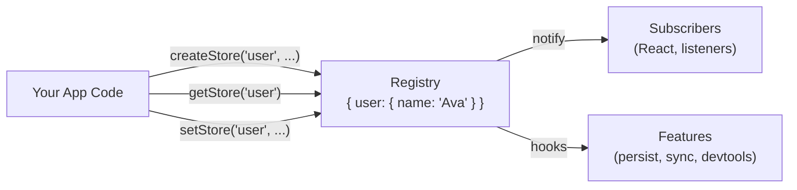
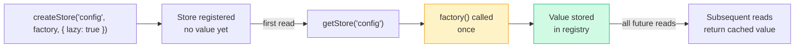
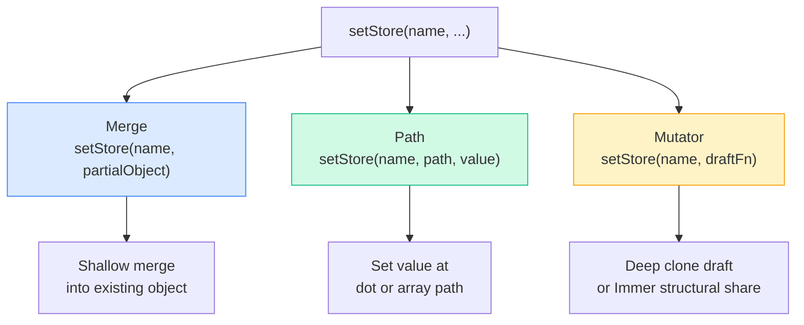
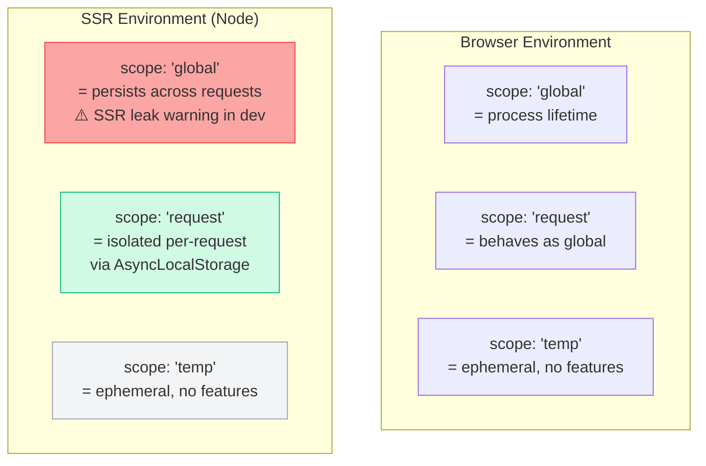
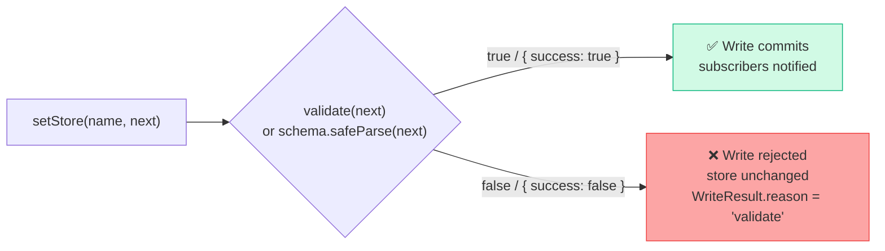
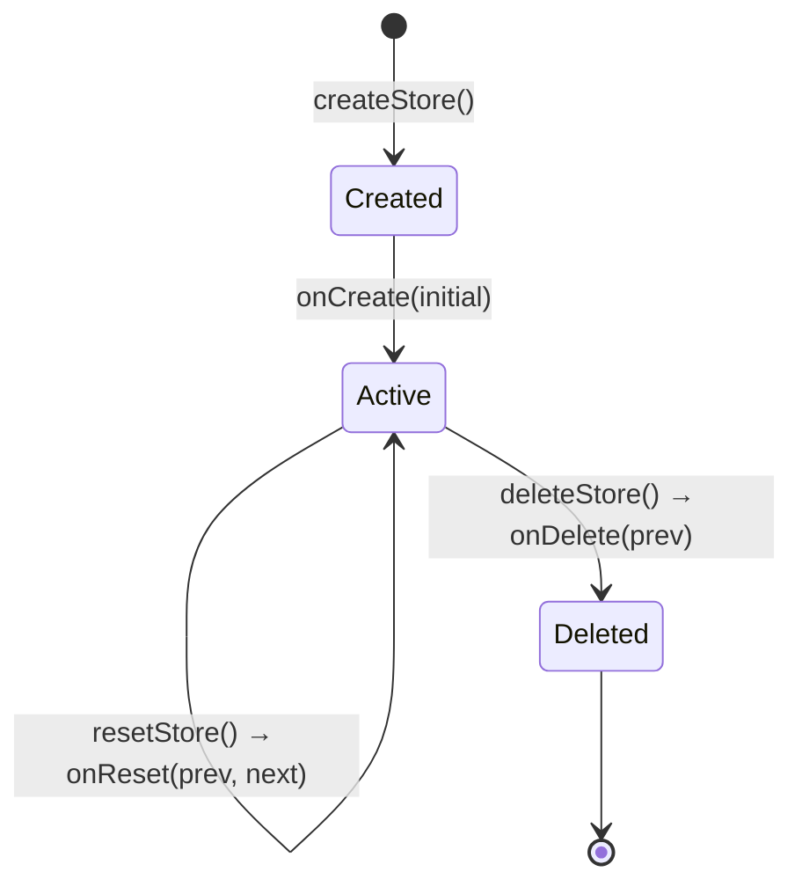
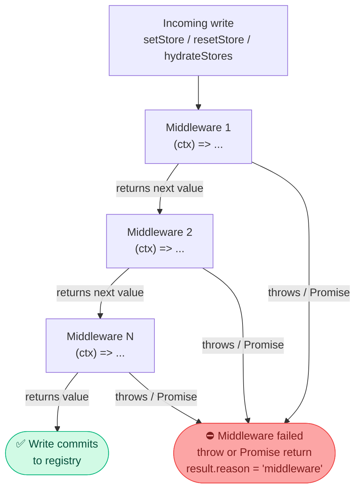
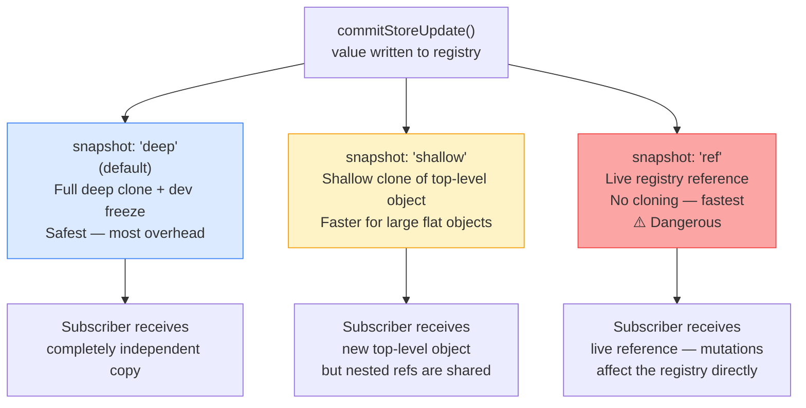
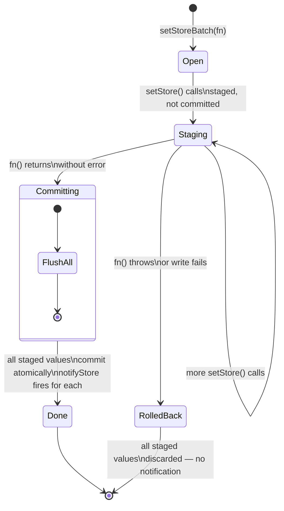
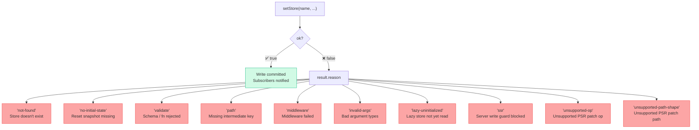

<div align="center">

# 🗃️ Core Concepts — Stores

[](.)
[](.)
[](.)
[](.)

**Everything you need to create, read, write, validate, and manage stores.**

</div>

---

> [!NOTE]
> **Confidence: HIGH** — derived from `src/core/store-create.ts`, `src/core/store-write.ts`, `src/adapters/options.ts`.

---

## 📚 Table of Contents

| # | Section | Topics |
|---|---------|--------|
| 1 | [What Is a Store?](#-what-is-a-store) | Naming model, registry slots, the one-line mental model |
| 2 | [Creating a Store](#-creating-a-store) | `createStore`, `createStoreStrict`, duplicates, lazy init |
| 3 | [Writing to a Store](#-writing-to-a-store) | Merge, path, mutator, replace — when to use each |
| 4 | [Reading a Store](#-reading-a-store) | `getStore`, dot paths, null semantics |
| 5 | [Scope](#-scope) | `request`, `global`, `temp` — lifetimes and SSR behavior |
| 6 | [Validation](#-validation) | Function validators, Zod / Yup / Valibot schemas |
| 7 | [Lifecycle Hooks](#-lifecycle-hooks) | `onCreate`, `onSet`, `onReset`, `onDelete` |
| 8 | [Middleware](#-middleware) | Intercept and transform writes before commit |
| 9 | [Snapshot Mode](#-snapshot-mode) | `deep`, `shallow`, `ref` — cloning depth and trade-offs |
| 10 | [Transactions](#-transactions-setstorebatch) | Atomic multi-store writes, rollback semantics |
| 11 | [WriteResult](#-writeresult) | Structured write outcomes, failure reasons |

---

## 🧱 What Is a Store?

A store is a **named slot in a registry** that holds a single JavaScript value. The name is the address — every read, write, subscription, and feature uses it to find the store.

```ts
createStore("user", { name: "Ava", role: "admin" })
//           ^^^^   ^^^^^^^^^^^^^^^^^^^^^^^^^^^^^^^^
//           name   initial value
```

That's it. The store is now available globally (or per-request in SSR) under `"user"`.



> [!TIP]
> A store name is a **primary key**. Every subsystem — notifications, devtools, SSR, persistence — addresses the store by that name alone. Choose names that are stable, descriptive, and unique across your app.

> [!NOTE]
> Store names are validated at runtime. Avoid spaces and reserved keys like `__proto__`, `constructor`, and `prototype` or `createStore()` will reject the name.

---

## 🏗️ Creating a Store

### The two creation APIs

```ts
import { createStore, createStoreStrict } from "stroid"

// Returns StoreDefinition | undefined — safe, silent on failure
const userStore = createStore("user", { name: "Ava" })

// Throws on failure — use when a missing store is a hard bug
const userStore = createStoreStrict("user", { name: "Ava" })
```

| API | Returns on success | On failure | Use when… |
|-----|--------------------|------------|-----------|
| `createStore` | `StoreDefinition` | `undefined` (no throw) | Most cases — graceful handling |
| `createStoreStrict` | `StoreDefinition` | Throws `Error` | Initialisation code where failure is fatal |

> [!TIP]
> Prefer `createStoreStrict` at app startup where you control the environment. Use `createStore` in library code or components that may run in unpredictable order.

---

### Duplicate names

If a store with the same name already exists, `createStore` returns `{ name }` **without modifying the existing store**. This is a deliberate silent no-op.

```ts
createStore("user", { name: "Ava" })
createStore("user", { name: "Kai" })  // ← silently ignored
getStore("user")                       // → { name: "Ava" }  — unchanged
```

> [!NOTE]
> This makes `createStore` safe to call multiple times — for example, in module initialisation code that may run more than once. The first caller wins; subsequent calls are harmless.

> [!WARNING]
> If you expect a different initial value to win, delete the store first or choose a unique store name. Silent deduplication can mask bugs if you're expecting an update.

---

### Lazy stores

A lazy store **defers initialisation** until the value is first read. The factory is called exactly once.

```ts
createStore("config", () => expensiveCompute(), { lazy: true })
//                    ^^^^^^^^^^^^^^^^^^^^^^^^^^^
//                    factory — not called yet

// Later, on first access:
getStore("config")  // ← triggers factory, result stored permanently
getStore("config")  // ← returns cached result — factory not called again
```



> [!TIP]
> Use lazy stores for values that are expensive to compute, require async setup, or depend on resources not available at module load time (e.g. `localStorage`, `window`, fetched config).

---

## ✍️ Writing to a Store

`setStore` supports **three public write modes**. The mode is inferred from the arguments you pass.



---

### 🔵 Merge — shallow merge into existing object

```ts
createStore("user", { name: "Ava", role: "admin" })

setStore("user", { role: "editor" })
// Result: { name: "Ava", role: "editor" }  ← name preserved, role updated
```

> [!NOTE]
> Merge is **shallow** — only top-level keys are merged. Nested objects are replaced, not merged. For deep nested updates, use a path write or mutator.

---

### 🟢 Path write — surgical update at a key or path

```ts
setStore("user", "role", "editor")                    // string key
setStore("user", ["profile", "name"], "Kai")          // array path → user.profile.name
setStore("user", "profile.address.city", "Berlin")    // dot-notation path
```

> [!WARNING]
> Intermediate paths **must exist** unless `pathCreate: true` is set in the store's options. Writing to `profile.name` when `profile` is `undefined` will fail and return a `WriteResult` with `reason: "path"`.

<details>
<summary>🔍 Enabling auto-creation of missing intermediate paths (click to expand)</summary>

```ts
createStore("user", {}, { pathCreate: true })

// Now safe even if profile doesn't exist yet
setStore("user", ["profile", "name"], "Kai")
// Result: { profile: { name: "Kai" } }
```

</details>

---

### 🟡 Mutator — function-based update with a draft

```ts
setStore("cart", draft => {
  draft.items.push({ id: "1", price: 50 })
  draft.updatedAt = Date.now()
})
```

By default the draft is a **deep clone** of the current value — mutations on it are safe and don't touch the live store until the function returns.

<details>
<summary>🔍 Enabling Immer for structural sharing (click to expand)</summary>

Register Immer's `produce` once at app startup to enable structural sharing in all mutators:

```ts
import { produce } from "immer"
import { registerMutatorProduce } from "stroid"

registerMutatorProduce(produce)

// Now all mutators use Immer — unchanged subtrees share references
setStore("cart", draft => {
  draft.items.push({ id: "2", price: 30 })
  // draft.user is unchanged → same reference as before → React bails out
})
```

> **🧠 Senior note:** Structural sharing is essential for performance in large stores used by many React components. Without Immer, every mutator write produces an entirely new object tree — all subtree references change, potentially causing unnecessary re-renders even in unrelated selectors.

</details>

---

### 🩷 Replace — full value replacement

The internal store write layer has replace semantics via `replaceStore`, but the published `stroid` and `stroid/core` entrypoints do not export that helper.

```ts
setStore("user", { role: "editor" })
// Shallow merge — existing keys survive
```

> [!WARNING]
> For object stores, public `setStore(name, object)` is a shallow merge, not a full replacement. If you need to guarantee that old object keys do not survive, recreate the store with `deleteStore()` + `createStore()`.

---

### Write mode comparison

| Mode | API | Merges? | Mutates draft? | Replaces entirely? |
|------|-----|---------|----------------|-------------------|
| Merge | `setStore(name, obj)` | ✅ Shallow | ❌ | ❌ |
| Path | `setStore(name, path, val)` | ❌ | ❌ | ❌ (targeted) |
| Mutator | `setStore(name, fn)` | ❌ | ✅ (on clone) | ❌ |
| Replace | `replaceStore(name, val)` *(internal write path)* | ❌ | ❌ | ✅ |

---

## 📖 Reading a Store

```ts
import { getStore } from "stroid"

getStore("user")                    // → { name: "Ava", role: "admin" } | null
getStore("user", "role")            // → "admin" | null
getStore("user", "profile.name")    // → dot-notation path
getStore("user", ["profile", "name"]) // → array path (equivalent)
```

Returns `null` in two cases: the store does not exist, or the specified path is not found.

> [!NOTE]
> `getStore` always returns a **snapshot** of the current value — not a live reference (unless `snapshot: "ref"` is configured). Mutations to the returned value do not affect the store.

> [!TIP]
> **For seniors:** `getStore` is synchronous and O(1) — it's just a property lookup on the registry object. It is safe to call in hot paths, render functions, and middleware without performance concerns.

---

## 🔭 Scope

Every store has a `scope` that controls its lifetime and server-side behaviour. The **default is `"request"`**, not `"global"`.



| Scope | Default? | Browser | SSR / Node | Features |
|-------|----------|---------|------------|----------|
| `"request"` | ✅ Yes | Behaves as global | Isolated per request | All enabled |
| `"global"` | ❌ | Process lifetime | ⚠️ Persists across requests — leak risk | All enabled |
| `"temp"` | ❌ | Ephemeral | Ephemeral | Persist, sync, devtools **disabled** |

```ts
// Explicit scope — for stores that must survive request boundaries
createStore("appConfig", { debug: false }, { scope: "global" })

// Temporary store — no persistence, no devtools, no sync overhead
createStore("uiDraft", {}, { scope: "temp" })
```

> [!WARNING]
> Using `scope: "global"` in an SSR app causes the store to persist across HTTP requests — a classic state bleed bug. Stroid emits a dev-mode warning when it detects this. Always use `scope: "request"` (the default) for any user-specific or request-specific data.

---

## ✅ Validation

Validation runs on **every write**. An invalid write is rejected — the store keeps its previous value and `setStore` returns `{ ok: false, reason: "validate" }`.

### Function validator

```ts
createStore("count", 0, {
  validate: (next) => typeof next === "number" && next >= 0
  //                  ^^^^^^^^^^^^^^^^^^^^^^^^^^^^^^^^^^^^
  //                  return true to accept, false to reject
})
```

### Schema validator (Zod, Yup, Valibot, etc.)

Any schema with a `.safeParse(value)` method works out of the box:

```ts
import { z } from "zod"

const UserSchema = z.object({
  name: z.string().min(1),
  role: z.enum(["admin", "editor", "viewer"]),
})

createStore("user", { name: "", role: "viewer" }, {
  validate: UserSchema  // stroid calls .safeParse internally
})
```



> [!TIP]
> Validation runs **after** middleware. If middleware fails before commit (for example by throwing or returning a `Promise`), no validated value is committed.

<details>
<summary>🧠 Senior note: validation + TypeScript narrowing (click to expand)</summary>

Validators can also narrow TypeScript types when typed explicitly. Combine with a Zod schema's `.parse` for fully typed store values:

```ts
import { z } from "zod"

const Schema = z.object({ name: z.string(), age: z.number() })
type User = z.infer<typeof Schema>

// Store is typed as User throughout your codebase
createStore<User>("user", { name: "Ava", age: 30 }, { validate: Schema })
```

</details>

### Supported validator shapes

| Validator type | Example | How Stroid uses it |
|---------------|---------|-------------------|
| `(next) => boolean` | Custom function | Calls directly, checks return value |
| Zod schema | `z.object({...})` | Calls `.safeParse(next)`, checks `.success` |
| Yup schema | `yup.object({...})` | Calls `.safeParse(next)`, checks `.success` |
| Valibot schema | `v.object({...})` | Calls `.safeParse(next)`, checks `.success` |
| Any object with `.safeParse` | Custom schema | Same — duck-typed interface |

---

## 🎣 Lifecycle Hooks

Lifecycle hooks let you react to store events — without subscribing to the store's value externally.

```ts
createStore("cart", { items: [] }, {
  lifecycle: {
    onCreate:  (initial)       => console.log("store created with", initial),
    onSet:     (prev, next)    => console.log("value changed"),
    onReset:   (prev, next)    => console.log("reset to", next),
    onDelete:  (prev)          => console.log("store removed, last value was", prev),
  }
})
```



### Hook reference

| Hook | Fires when | Arguments | Common uses |
|------|-----------|-----------|-------------|
| `onCreate` | Store is first created | `(initialValue)` | Seed side effects, analytics, logging |
| `onSet` | Any successful write commit | `(prev, next)` | Dirty-tracking, external sync |
| `onReset` | `resetStore` is called | `(prev, next)` | Audit logs, undo history |
| `onDelete` | `deleteStore` is called | `(lastValue)` | Cleanup, teardown side effects |

> [!WARNING]
> The top-level shorthand options (`onCreate`, `onSet`, etc. at the store options root) are **deprecated**. Always use the `lifecycle: { ... }` grouping shown above.

```ts
// ❌ Deprecated — top-level shorthand
createStore("cart", [], { onSet: (prev, next) => {} })

// ✅ Correct — lifecycle grouping
createStore("cart", [], { lifecycle: { onSet: (prev, next) => {} } })
```

---

## 🛡️ Middleware

Middleware **intercepts every write** before it commits. It can inspect and transform the incoming value.

```ts
createStore("cart", { items: [] }, {
  lifecycle: {
    middleware: [
      (ctx) => {
        return {
          ...(ctx.next as { items: unknown[] }),
          updatedAt: Date.now(),
        }
      }
    ]
  }
})
```

### The middleware context object

```ts
interface MiddlewareContext {
  action: string
  name: string
  prev: unknown
  next: unknown
  path: unknown
  correlationId?: string
  traceContext?: object
}
```



### Middleware chaining

| Return value | Effect |
|-------------|--------|
| `ctx.next` or any value | Passes that value forward to the next middleware (or commits if last) |
| `undefined` | Pass-through — same as returning `ctx.next` unchanged |
| `throw` / `Promise` | Write fails with `reason: "middleware"` |

> [!TIP]
> Middleware runs **in array order** — the output of middleware N becomes the `ctx.next` of middleware N+1. The final surviving value is what commits to the store.

### Global middleware

```ts
// Applied to every store in the registry
configureStroid({
  middleware: [
    (ctx) => {
      console.log(`[${ctx.name}] ${ctx.action}`, ctx.next)
      return ctx.next
    }
  ]
})
```

> [!NOTE]
> Store-level middleware runs **before** global middleware. Global middleware sees the output produced by the store-level chain.

---

## 📸 Snapshot Mode

Snapshot mode controls **how subscriber callbacks receive store values** — specifically, whether and how deeply the value is cloned before delivery.



### Mode comparison

| Mode | Clone depth | Dev freeze? | Speed | Safe to mutate? |
|------|------------|-------------|-------|-----------------|
| `"deep"` *(default)* | Full recursive clone | ✅ Yes | Slowest | ✅ Yes — fully independent |
| `"shallow"` | Top-level object only | ❌ | Fast | ⚠️ Top level only |
| `"ref"` | No clone | ❌ | Fastest | ❌ Never — live reference |

```ts
// Per-store snapshot mode
createStore("largeList", [], { snapshot: "shallow" })

// Global default
configureStroid({ defaultSnapshotMode: "shallow" })
```

> [!WARNING]
> `snapshot: "ref"` gives subscribers a **live reference to the internal store value**. Any mutation will silently corrupt the store without triggering a write, bypassing middleware, validation, and notification. Use only in controlled, performance-critical scenarios where you have full ownership of all mutation paths.

> [!TIP]
> **Senior guidance:** Use `"shallow"` for stores with large, flat data (lists of IDs, lookup tables) where only top-level references change between writes. Reserve `"deep"` (the default) for stores whose nested values are passed deeply into components.

---

## 📦 Transactions (`setStoreBatch`)

`setStoreBatch` provides **atomic multi-store writes**. All writes inside the function either all commit together, or all roll back if anything throws.

```ts
import { setStoreBatch } from "stroid"

setStoreBatch(() => {
  setStore("order",  { id: "x", status: "pending" })
  setStore("cart",   { items: [] })
  setStore("ui",     "loading", false)
})
// All three commit atomically → subscribers notified after all commits
// If any throws → all three roll back → no subscribers notified
```



### Rules inside a batch

| Operation | Allowed? | Reason |
|-----------|----------|--------|
| `setStore` | ✅ Yes | Core purpose |
| `replaceStore` | ✅ Yes *(internal write path)* | Treated as staged write |
| `createStore` | ❌ No | Throws or warns |
| `deleteStore` | ❌ No | Throws or warns |
| `hydrateStores` | ❌ No | Throws or warns |

> [!WARNING]
> `createStore`, `deleteStore`, and `hydrateStores` cannot be called inside a batch. They mark the active batch as failed instead of committing partial transaction state.

> [!TIP]
> **Senior note:** Batches are the correct tool for any operation that must update multiple stores atomically — checkout flows, form submissions, optimistic UI updates with paired state. Without a batch, each `setStore` triggers a separate notification flush, which can cause intermediate renders with inconsistent state between related stores.

---

## 📋 WriteResult

Every write operation returns a structured `WriteResult` — never throws unless you use the strict APIs.

```ts
const result = setStore("user", "name", "Kai")

if (result.ok) {
  // write committed successfully
} else {
  console.error("write failed:", result.reason)
}
```

### Failure reason reference

| `result.reason` | What happened | How to fix |
|-----------------|---------------|------------|
| `"not-found"` | No store exists with that name | Call `createStore` first |
| `"no-initial-state"` | The store exists, but its reset snapshot is missing | Recreate the store or materialise a valid initial state before resetting |
| `"validate"` | Validator or schema rejected the value | Fix the value or the validator |
| `"path"` | Intermediate path segment does not exist | Use `pathCreate: true` or ensure path exists |
| `"middleware"` | A middleware threw or returned an unsupported async result | Inspect middleware logic |
| `"invalid-args"` | Invalid argument types passed to `setStore` | Check argument shapes |
| `"lazy-uninitialized"` | Tried to write to a lazy store before its first read | Call `getStore` first to initialise |
| `"ssr"` | A server-only write guard blocked the operation | Use request-scoped APIs on the server |
| `"unsupported-op"` | A PSR patch used an unsupported operation | Use `set`, `merge`, `delete`, or `insert` |
| `"unsupported-path-shape"` | A PSR patch used an unsupported path shape | Use canonical path arrays for patch writes |



<details>
<summary>🔍 Full WriteResult type (click to expand)</summary>

```ts
type WriteResult =
  | { ok: true }
  | {
      ok: false
      reason:
        | "not-found"
        | "no-initial-state"
        | "validate"
        | "path"
        | "middleware"
        | "ssr"
        | "invalid-args"
        | "lazy-uninitialized"
        | "unsupported-op"
        | "unsupported-path-shape"
    }
```

</details>

> [!TIP]
> Always check `result.ok` in critical write paths — checkout, auth, settings saves. Silent failures are easy to miss without it.

---

<div align="center">

*Docs maintained by the Stroid core team.*
*See a mistake? Open a PR — all claims trace directly to source.*

</div>
