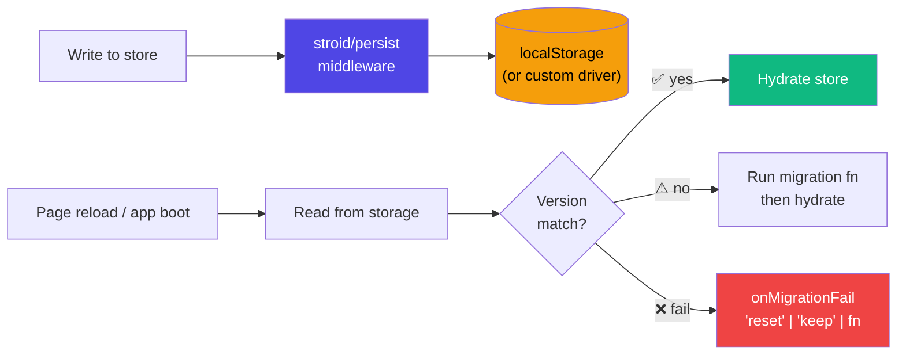
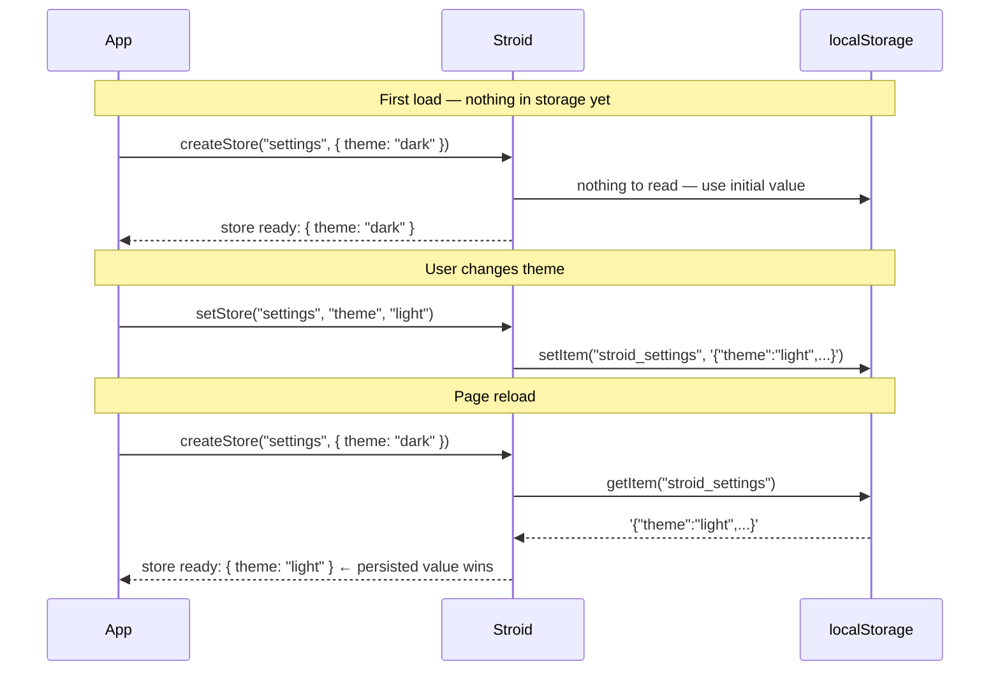
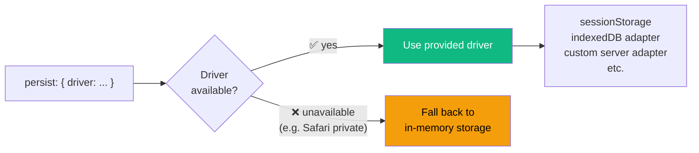
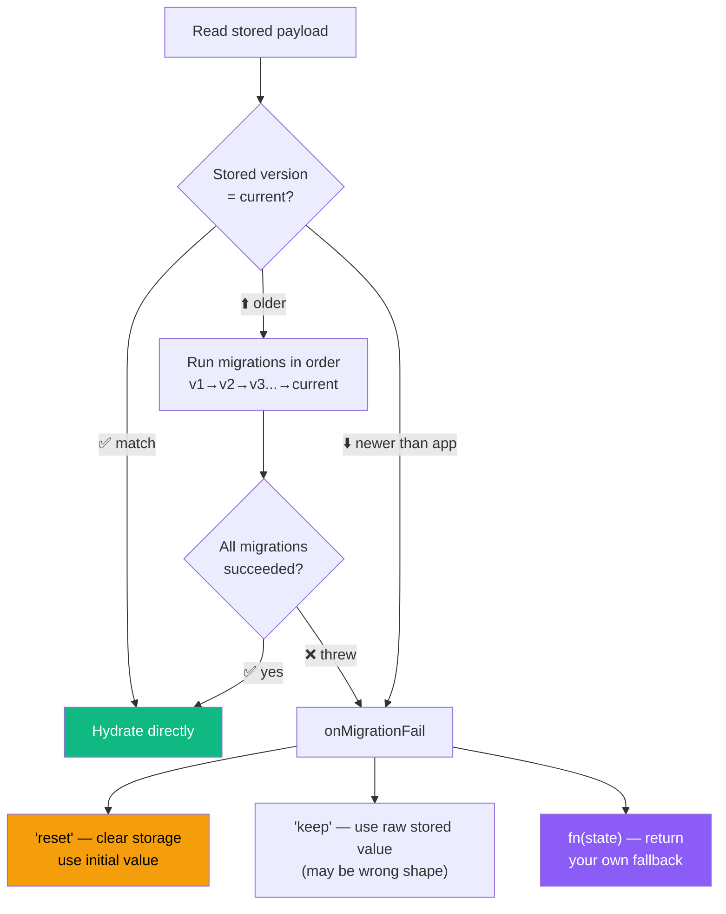
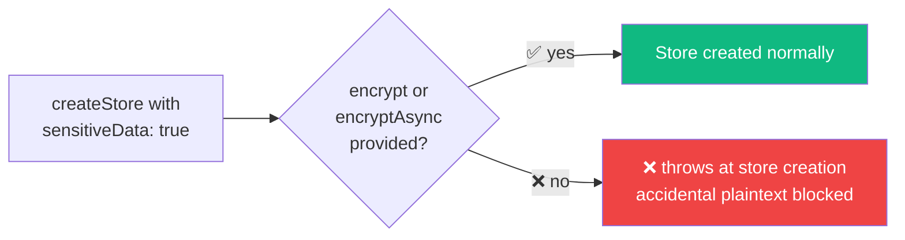
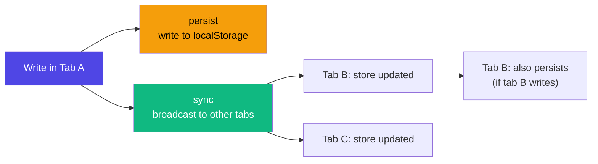

# 💾 Persistence Guide

> **Version:** 0.1.4 &nbsp;|&nbsp; **Last Updated:** 2026-03-30 &nbsp;|&nbsp; **Confidence:** 
>
> *Derived from `src/features/persist.ts`, `src/features/persist/*`, `src/adapters/options.ts`*

---

## 📚 Table of Contents

- [What Is Persistence?](#-what-is-persistence)
- [Setup](#-setup)
- [Basic Usage](#-basic-usage)
- [Persist Options](#-persist-options)
- [Custom Storage Driver](#-custom-storage-driver)
- [Versioning & Migrations](#-versioning--migrations)
- [Encryption](#-encryption)
  - [Sync Encryption](#sync-encryption)
  - [Async Encryption](#async-encryption)
- [Integrity Checking](#-integrity-checking)
- [Size Limits](#-size-limits)
- [Sensitive Data Guard](#-sensitive-data-guard)
- [onStorageCleared](#-onstoragecleared)
- [Persist + Sync Together](#-persist--sync-together)
- [Defaults Reference](#-defaults-reference)
- [Platform Gotchas](#-platform-gotchas)

---

## 💡 What Is Persistence?

Persistence saves your store's state to browser storage (by default `localStorage`) so that it **survives page reloads**. When the app boots, the store is automatically re-hydrated from the saved value — no manual wiring needed.



> [!NOTE]
> Persistence is opt-in per store. A store without `persist` options is never written to storage — even if `installPersist()` has been called globally.

---

## ⚙️ Setup

Install the persist feature **once** at your app's entry point, before any persisted store is created:

```ts
// main.tsx or app entry
import { installPersist } from "stroid/persist"

installPersist()
```

> [!WARNING]
> Without calling `installPersist()`, any store configured with `persist` options fails feature registration. By default this throws because `strictMissingFeatures` defaults to `true`.
> If you intentionally set `strictMissingFeatures: false`, Stroid downgrades that failure to a warning and leaves persistence inactive for that store.

> [!TIP]
> Call `installPersist()` before any `createStore()` call that uses `persist`. The install step registers the internal storage adapter and hydration hooks — stores created before it is called will miss their hydration window.

---

## 🚀 Basic Usage

The simplest setup — set `persist: true` and everything else is handled automatically:

```ts
import { createStore }    from "stroid"
import { installPersist } from "stroid/persist"

installPersist()

createStore("settings", { theme: "dark", lang: "en" }, {
  persist: true  // ← saves to localStorage with key "stroid_settings"
})
```

**What happens on first load and on reload:**



> [!TIP]
> The persisted value **always wins over the initial value** on hydration. If you need to reset state on boot (e.g. after a logout), call `resetStore("settings")` explicitly rather than relying on the initial value.

---

## 🔧 Persist Options

For fine-grained control, pass a configuration object instead of `true`:

```ts
createStore("settings", { theme: "dark" }, {
  persist: {
    key:             "app-settings",      // custom storage key (default: "stroid_{name}")
    allowPlaintext:  true,                // required when no encrypt hook is provided
    version:         2,                   // current schema version
    migrations: {
      1: (old) => ({ ...old, lang: "en" }),  // upgrade stored v1 data → v2 shape
    },
    onMigrationFail:  "reset",            // "reset" | "keep" | (state) => state
    onStorageCleared: ({ name, reason }) => {
      console.warn(`${name} cleared: ${reason}`)
    },
  }
})
```

> [!WARNING]
> The `migrations` format is `Record<version_number, migrationFn>` — **not** an inline `migrate` callback. Any documentation or examples showing `migrate: (old, v) => ...` are incorrect. Always use the `migrations` object format shown above.

---

## 🗄 Custom Storage Driver

Swap `localStorage` for any storage backend that implements `{ getItem, setItem, removeItem }`:

```ts
createStore("session", { token: null }, {
  persist: {
    driver:         window.sessionStorage,  // built-in sessionStorage
    key:            "app-session",
    allowPlaintext: true,
  }
})
```



> [!NOTE]
> When the requested driver is unavailable (e.g. `sessionStorage` in a browser that blocks it, or `localStorage` in Safari private mode), Stroid **falls back to in-memory storage** and emits a dev warning. The store behaves normally for the session — state just won't persist across reloads.

<details>
<summary>🧠 <strong>Building a custom storage driver</strong></summary>

Any object with these three methods qualifies as a driver:

```ts
interface StorageDriver {
  getItem(key: string): string | null
  setItem(key: string, value: string): void
  removeItem(key: string): void
}
```

Example — an IndexedDB-backed async driver wrapped for synchronous access:

```ts
const idbDriver: StorageDriver = {
  getItem:    (key) => idbCache.get(key) ?? null,   // reads from a primed sync cache
  setItem:    (key, val) => { idbCache.set(key, val); idb.put(key, val) },  // write-through
  removeItem: (key) => { idbCache.delete(key); idb.delete(key) },
}

createStore("drafts", {}, { persist: { driver: idbDriver, allowPlaintext: true } })
```

Example — a `sessionStorage` driver for per-tab state that resets on close:

```ts
persist: { driver: window.sessionStorage, key: "tab-state", allowPlaintext: true }
```

</details>

---

## 🔄 Versioning & Migrations

When your store's shape changes between app versions, migrations upgrade stored data to the new schema automatically:

```ts
createStore("settings", { theme: "dark", lang: "en", notifications: true }, {
  persist: {
    key:     "app-settings",
    version: 3,              // current schema version
    migrations: {
      1: (old) => ({ ...old, lang: "en" }),                      // v1 → v2: add lang
      2: (old) => ({ ...old, notifications: true }),             // v2 → v3: add notifications
    },
    onMigrationFail: "reset",  // if migration throws: clear storage and use initial value
  }
})
```

**Migration flow:**



**`onMigrationFail` options:**

| Value | Behaviour | When to use |
|---|---|---|
| `"reset"` *(default)* | Clears storage, uses initial value | Safe default — avoids corrupt state |
| `"keep"` | Uses the raw stored value as-is | When you'd rather show stale data than lose it |
| `(state) => state` | Custom recovery function | Complex fallback logic (e.g. partial rescue) |

> [!WARNING]
> **Never remove or renumber old migration keys.** Migrations are applied incrementally — removing `1` means users who stored v1 data will skip that step and land on a corrupt v2 state. Only add new keys; never delete old ones.

> [!TIP]
> Write migrations as **pure, defensive functions**. Assume the stored data may be missing fields, have wrong types, or be partially upgraded. Use optional chaining (`old?.field ?? defaultValue`) to handle edge cases safely.

<details>
<summary>🧠 <strong>Migration chain execution — how it works</strong></summary>

Stroid stores the `version` number alongside the payload. On hydration:

1. Read the stored `version`
2. Collect all migration keys between `storedVersion + 1` and `currentVersion`
3. Run them in ascending numeric order, piping each result into the next
4. Hydrate the store with the final migrated value

This means your migration function at key `N` should transform **v(N-1) shape → vN shape** only. It is never called for data already at vN or above.

```ts
// key 1: transforms v1 → v2
migrations: {
  1: (v1State) => ({ ...v1State, newField: "default" }),  // add a field
  2: (v2State) => { const { oldField, ...rest } = v2State; return rest },  // remove a field
}
```

</details>

---

## 🔐 Encryption

### Sync Encryption

For synchronous cipher implementations (e.g. AES in a WASM module, or a pre-keyed sync API):

```ts
createStore("vault", { apiKey: "" }, {
  persist: {
    key:           "secure-vault",
    encrypt:       (data) => myAES.encrypt(data),
    decrypt:       (raw)  => myAES.decrypt(raw),
    sensitiveData: true,  // throws if no encrypt hook is provided (safety guard)
  }
})
```

### Async Encryption

For Web Crypto API or any promise-returning cipher:

```ts
createStore("vault", { apiKey: "" }, {
  persist: {
    key:          "secure-vault",
    encryptAsync: async (data) => await webCrypto.encrypt(data),
    decryptAsync: async (raw)  => await webCrypto.decrypt(raw),
  }
})
```

> [!WARNING]
> `encrypt` / `decrypt` and `encryptAsync` / `decryptAsync` are **two separate pairs**. You must provide both members of a pair together. Mixing sync `encrypt` with async `decryptAsync` throws at store creation — mismatched pairs are not supported.

> [!TIP]
> Use the Web Crypto API (`encryptAsync` / `decryptAsync`) when running in a browser with SubtleCrypto available — it's hardware-accelerated and does not block the main thread. Reserve sync encryption for environments where async is not practical (e.g. a sync SSR data loader).

<details>
<summary>🧠 <strong>Web Crypto integration example</strong></summary>

```ts
// Derive a key from a user password (do this once at login):
const cryptoKey = await window.crypto.subtle.importKey(
  "raw",
  new TextEncoder().encode(userPassword),
  { name: "AES-GCM" },
  false,
  ["encrypt", "decrypt"]
)

const iv = window.crypto.getRandomValues(new Uint8Array(12))

createStore("vault", { secret: "" }, {
  persist: {
    key: "user-vault",
    encryptAsync: async (plaintext) => {
      const enc = new TextEncoder().encode(plaintext)
      const buf = await window.crypto.subtle.encrypt({ name: "AES-GCM", iv }, cryptoKey, enc)
      return btoa(String.fromCharCode(...new Uint8Array(buf)))
    },
    decryptAsync: async (ciphertext) => {
      const buf = Uint8Array.from(atob(ciphertext), c => c.charCodeAt(0))
      const dec = await window.crypto.subtle.decrypt({ name: "AES-GCM", iv }, cryptoKey, buf)
      return new TextDecoder().decode(dec)
    },
  }
})
```

Store the `iv` in a separate, non-sensitive storage key — it does not need to be secret, only consistent between encrypt and decrypt calls.

</details>

---

## 🔎 Integrity Checking

Stroid can checksum persisted payloads to detect accidental corruption between writes and reads:

```ts
persist: {
  checksum: "hash",    // default — fast POJO hash, non-cryptographic
  checksum: "sha256",  // stronger SHA-256 (may be async in browsers)
  checksum: "none",    // disable checksum entirely
}
```

| Mode | Strength | Speed | Use case |
|---|---|---|---|
| `"hash"` *(default)* | Non-cryptographic | ⚡ Fast | Detect accidental corruption (bit flips, truncation) |
| `"sha256"` | Cryptographic hash | 🐢 Slower (async in browsers) | Stronger integrity — still forgeable without a secret |
| `"none"` | None | ⚡ Fastest | High-frequency writes where integrity is not needed |

> [!WARNING]
> Neither `"hash"` nor `"sha256"` protects against **adversarial tampering** — a user with DevTools access can rewrite both the payload and the checksum. For tamper resistance, use `encrypt` / `encryptAsync` with a server-derived key, not a checksum alone.

---

## 📏 Size Limits

Reject oversized payloads at hydration time to prevent performance issues from unbounded state growth:

```ts
persist: {
  maxSize: 50_000,  // characters — hydration skipped if stored payload exceeds this
}
```

> [!NOTE]
> `maxSize` is checked at **hydration time** (on read), not at write time. Writes larger than `maxSize` succeed and are persisted — the limit only applies when loading the value back into the store.

> [!TIP]
> `persist.maxSize` warnings fire in dev when an unbounded payload at hydration crosses a large internal threshold. Set an explicit `maxSize` in production for stores that can grow without bound — for example, stores containing user-generated content, log buffers, or large list data.

---

## 🛡 Sensitive Data Guard

Declare a store as sensitive to make accidental plaintext persistence a **hard error at creation time**:

```ts
persist: {
  sensitiveData: true,  // throws at store creation if no encrypt/encryptAsync is provided
}
```



> [!TIP]
> Add `sensitiveData: true` to any store holding tokens, API keys, PII, or credentials. It costs nothing at runtime and turns a potential security incident (accidentally shipping unencrypted secrets to `localStorage`) into a loud development-time error.

---

## 📡 `onStorageCleared`

Called when the storage key is **externally removed** — by another tab clearing `localStorage`, DevTools, OS storage eviction, or a programmatic clear:

```ts
persist: {
  onStorageCleared: ({ name, key, reason }) => {
    // name   → store name ("settings")
    // key    → storage key ("app-settings")
    // reason → "clear" | "remove" | "missing"

    if (reason === "clear" || reason === "remove") {
      redirectToLogin()  // treat external clear as a session invalidation signal
    }
  }
}
```

**Reason values:**

| Reason | What triggered it |
|---|---|
| `"clear"` | `localStorage.clear()` was called (e.g. by another tab or DevTools) |
| `"remove"` | The specific key was deleted (`localStorage.removeItem(key)`) |
| `"missing"` | Key was expected on hydration but not found (first load after storage eviction) |

> [!TIP]
> Use `onStorageCleared` to detect session invalidation in multi-tab apps. If an auth token store is cleared externally, redirect to login or re-fetch a fresh token — don't silently continue with stale in-memory state.

---

## 🔄 Persist + Sync Together

`persist` and `sync` compose fully. A write in any tab is both saved to `localStorage` **and** broadcast to all other tabs:

```ts
import { installPersist } from "stroid/persist"
import { installSync }    from "stroid/sync"

installPersist()
installSync()

createStore("settings", { theme: "dark" }, {
  persist: { key: "app-settings", allowPlaintext: true },
  sync:    { channel: "settings-sync", authToken: "token" },
})
```



> [!TIP]
> With both features active, a freshly opened tab **hydrates from `localStorage`** first (persist), then stays live via `BroadcastChannel` (sync). The result: durability across reboots **and** real-time consistency across open tabs.

> [!NOTE]
> `scope: "temp"` automatically disables both persistence and sync for that store. Temp-scoped stores are always ephemeral — this cannot be overridden.

---

## 📋 Defaults Reference

| Option | Default | Notes |
|---|---|---|
| `driver` | `localStorage` | Falls back to in-memory if unavailable |
| `key` | `"stroid_{storeName}"` | Custom key avoids collisions with other apps |
| `serialize` | `JSON.stringify` | Replace for non-JSON state (e.g. `Date` objects) |
| `deserialize` | `JSON.parse` | Must match your `serialize` function |
| `checksum` | `"hash"` | Non-cryptographic fast integrity check |
| `onMigrationFail` | `"reset"` | Clears storage and uses initial value |
| `allowPlaintext` | `false` | Must be set to `true` when no encrypt hook is provided |
| `sensitiveData` | `false` | Set to `true` to require encryption at store creation |

---

## ⚠️ Platform Gotchas

<details>
<summary>🍎 <strong>Safari / WebKit — 7-Day Storage Eviction</strong></summary>

Safari's **Intelligent Tracking Prevention (ITP)** policy can **delete all script-writable storage** after 7 days of inactivity on a site (measured by Safari usage, not calendar time). This affects:

- `localStorage`
- `sessionStorage`
- `IndexedDB`
- Service Worker storage

**What this means for Stroid's `persist`:**

If you use `persist` for auth tokens, shopping carts, draft content, or any other user-critical state, **do not assume browser storage is durable on Safari**. A user who visits your app less than once a week may lose persisted state silently.

**Recommended mitigations:**

```ts
persist: {
  onStorageCleared: ({ reason }) => {
    // Fired on "missing" when ITP has evicted the key
    if (reason === "missing") {
      refetchFromServer()  // or prompt the user to re-authenticate
    }
  }
}
```

- Back critical persisted state with **server-side storage** and re-hydrate on load
- Use `onStorageCleared` with `reason === "missing"` to detect eviction and trigger a recovery flow
- Treat `localStorage` on Safari as a **performance cache**, not a source of truth

> WebKit explicitly documents `LocalStorage`, `IndexedDB`, `SessionStorage`, and Service Worker storage as subject to this policy.

</details>

<details>
<summary>🕵️ <strong>Private / Incognito Mode</strong></summary>

In private/incognito mode, most browsers restrict or sandbox storage:

| Browser | Private mode behaviour |
|---|---|
| Safari | `localStorage` throws on write — Stroid falls back to in-memory |
| Firefox | `localStorage` works but is cleared on session end |
| Chrome | `localStorage` works in session — cleared on close |

Stroid gracefully falls back to in-memory storage when the driver is unavailable, so your app will function normally in private mode — state just won't survive tab close or reload.

</details>

---

*© Stroid Docs — Generated 2026-03-29*
