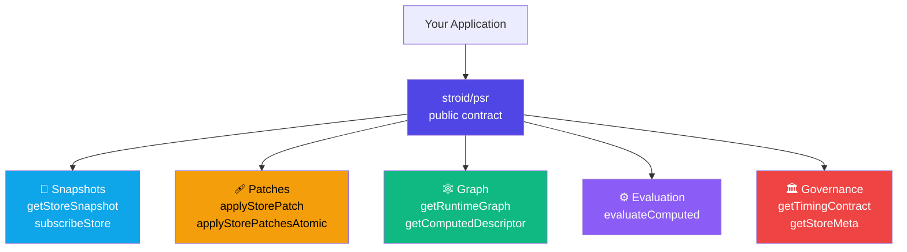
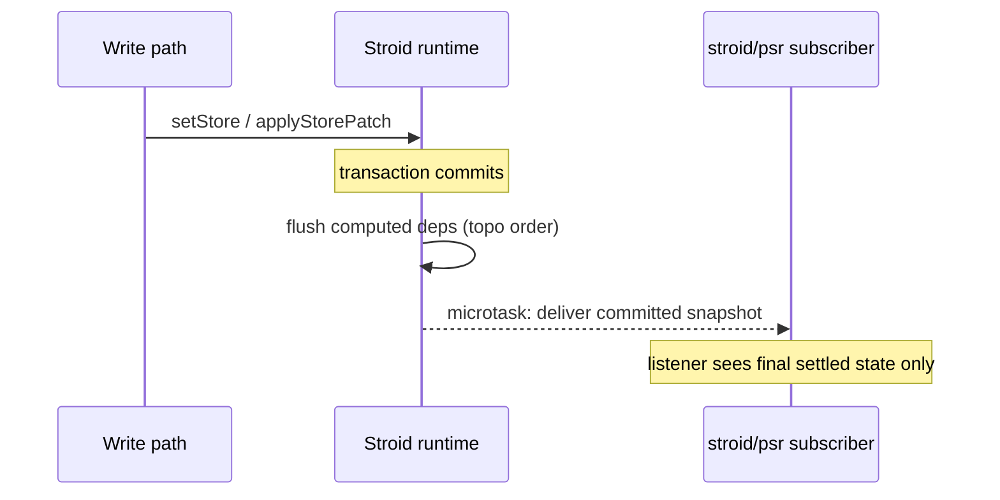
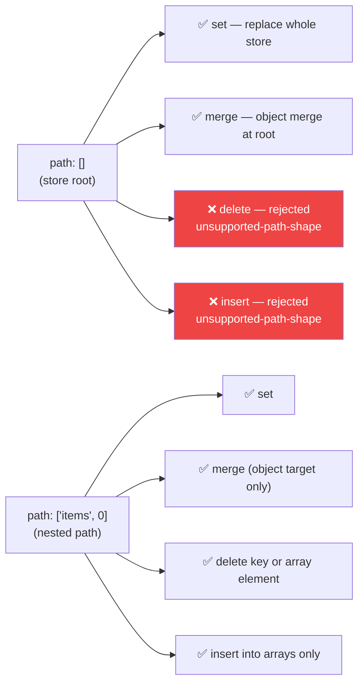
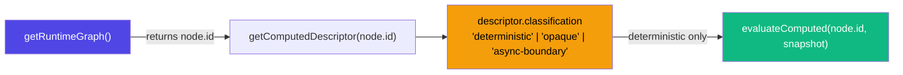
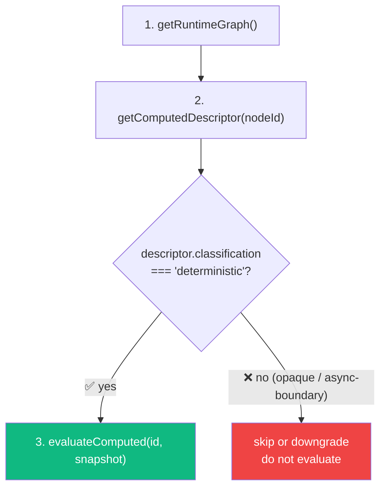
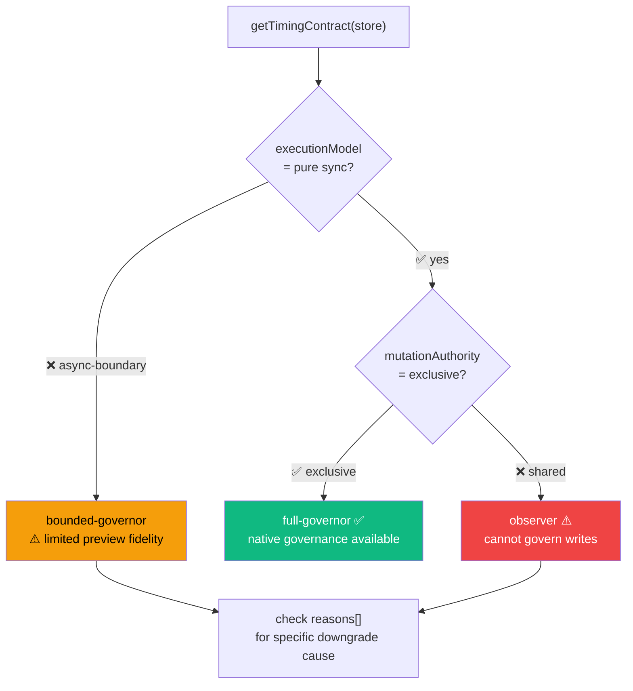
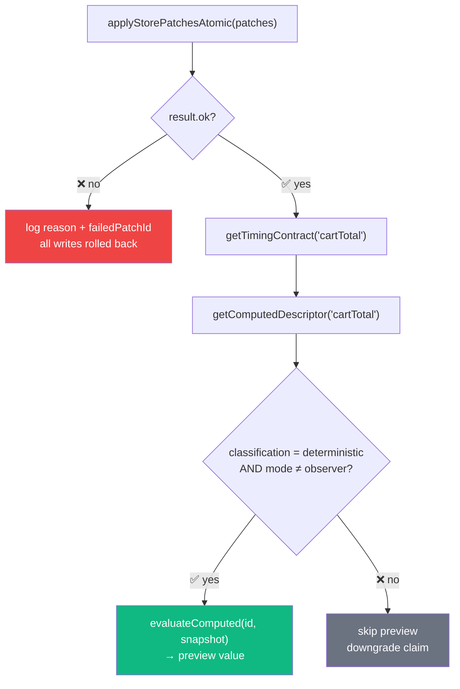

# 🔬 Native PSR Contract

> **Version:** 0.1.4 &nbsp;|&nbsp; **Last Updated:** 2026-03-30 &nbsp;|&nbsp; **Confidence:** 
>
> *Derived from `src/psr/index.ts`, `src/runtime-tools/index.ts`, the notification pipeline, and built-package PSR contract tests.*

---

## 📚 Table of Contents

- [What Is stroid/psr?](#-what-is-stroidpsr)
- [Support Matrix](#-support-matrix)
- [Snapshot & Subscription Semantics](#-snapshot--subscription-semantics)
  - [getStoreSnapshot](#getstoretarget)
  - [getStoreSnapshotNoTrack](#getstorenothintotarget)
  - [subscribeStore](#subscribestoretarget-listener)
- [Patch Contract](#-patch-contract)
  - [Patch Shape](#patch-shape)
  - [Canonical Path Rules](#canonical-path-rules)
  - [Supported Ops](#supported-ops)
  - [Stable Failure Reasons](#stable-failure-reasons)
  - [failedPatchId](#failedpatchid)
- [Graph Identity & Node IDs](#-graph-identity--node-ids)
- [Deterministic Computed Evaluation](#-deterministic-computed-evaluation)
- [Timing, Governance & Downgrade Rules](#-timing-governance--downgrade-rules)
- [Mutation-Affecting Metadata](#-mutation-affecting-metadata)
- [Full Example](#-full-example)

---

## 💡 What Is `stroid/psr`?

`stroid/psr` is the **public native contract** for PSR-style preview, commit, batch, graph, and governance work. It gives you a stable, serializable surface to interact with the Stroid runtime — without touching internal write paths directly.



**Import everything you need from one entry point:**

```ts
import {
  getStoreSnapshot,
  subscribeStore,
  applyStorePatch,
  applyStorePatchesAtomic,
  getRuntimeGraph,
  getComputedDescriptor,
  evaluateComputed,
  getTimingContract,
  getStoreMeta,
} from "stroid/psr"
```

> [!NOTE]
> Use `stroid/psr` when you need committed-only store snapshots, serializable runtime patch execution, runtime graph and computed descriptors, deterministic computed evaluation, or timing/governance visibility. If a runtime behavior is **not** exposed through these APIs, treat it as outside the PSR faithfulness contract and downgrade accordingly.

<details>
<summary>🧠 <strong>What does "PSR contract" mean, and why does it matter?</strong></summary>

PSR (Preview / Commit / Subscribe with Rollback) is the governance model Stroid uses to make writes **safe to preview before committing** and **atomic when batched**. The `stroid/psr` module is the public surface of that model.

Why use it instead of writing directly to stores?

- **Serializable patches** — every write is a plain JSON object you can log, replay, or diff
- **Atomic batches** — `applyStorePatchesAtomic` either commits all or rolls back all, with no partial notification leaks
- **Governance visibility** — `getTimingContract` tells you *before* a write whether native full-fidelity governance is available, so you can downgrade gracefully instead of silently lying about your certainty

This is the API surface used by devtools, time-travel debuggers, server-side rendering hydration, and any system that needs to reason about Stroid state from outside a React component tree.

</details>

---

## 📊 Support Matrix

| PSR Concern | Public `stroid/psr` API |
|---|---|
| **preview** | `getStoreSnapshot()`, `getRuntimeGraph()`, `getComputedDescriptor()`, `evaluateComputed()` |
| **commit** | `applyStorePatch()` with serializable runtime patches |
| **batch** | `applyStorePatchesAtomic()` with rollback and `failedPatchId` reporting |
| **onCommit** | `subscribeStore()` committed-final notifications |
| **propagation** | `getRuntimeGraph()` + `getComputedDescriptor()` |
| **governance** | `getTimingContract()` + `getStoreMeta()` |
| **mutation metadata** | `getStoreMeta()` for options/metrics, `getComputedDescriptor()` for computed classification |

> [!WARNING]
> If a runtime behaviour is **not** represented in this matrix, treat the corresponding store or operation as outside the strongest PSR faithfulness claim. Do not attempt to extend or infer the contract from internal APIs.

---

## 📸 Snapshot & Subscription Semantics

All snapshot and subscription APIs deal exclusively with **committed state** — transactional in-progress writes are never visible here.



---

### `getStoreSnapshot(target)`

Returns the **committed store snapshot** for a store name, `StoreDefinition`, or `StoreKey`.

```ts
const snap = getStoreSnapshot("cart")
// → { items: [...] }  ← committed state only
```

- ✅ Returns committed state only — no in-progress transactional state
- ✅ Does **not** increment read tracking counts
- ✅ Safe to call outside React render cycles

---

### `getStoreSnapshotNoTrack(target)`

Alias of the same committed-only read path. Use it when you want the no-track intent to be explicit at the call site.

```ts
// Both are identical in behavior:
getStoreSnapshot("cart")
getStoreSnapshotNoTrack("cart")  // ← intent is self-documenting
```

> [!TIP]
> Prefer `getStoreSnapshotNoTrack` in governance and observability code where making read tracking explicit improves code review legibility.

---

### `subscribeStore(target, listener)`

Subscribes to committed-final notifications for a single store.

```ts
const unsub = subscribeStore("cart", (snapshot) => {
  console.log("cart settled to:", snapshot)
})

// Later:
unsub()  // idempotent — safe to call multiple times
```

**Delivery guarantees:**

| Behaviour | Detail |
|---|---|
| Snapshot type | Committed only — no transactional intermediate state |
| Delivery timing | Queued post-commit; flushed on microtask (same-turn, not inline) |
| Batch writes | `setStoreBatch` and `applyStorePatchesAtomic` publish the **final settled state only** |
| Computed stores | Notified after dependency writes settle in flush order |
| Unsubscribe | Returned function is **idempotent** |

> [!NOTE]
> Listeners fire on a **microtask** after commit — not synchronously inside the write. This means you'll never see a half-committed batch in a listener, and you can safely read other stores inside a listener without risking stale intermediate values.

<details>
<summary>🧠 <strong>Why microtask delivery instead of synchronous?</strong></summary>

Synchronous listener delivery inside a write creates re-entrancy hazards: a listener that triggers another write can cause notification loops, ordering glitches, or stack overflows. By scheduling delivery on a microtask, Stroid ensures:

1. The write pipeline has fully settled before any listener runs
2. Multiple writes in the same synchronous turn are coalesced — listeners see only the final value
3. Computed store flush ordering has completed — no stale computed values in listeners

This matches the delivery model of `Promise.then`, `queueMicrotask`, and `MutationObserver` — same-turn but post-mutation.

</details>

---

## 🩹 Patch Contract

All public PSR patches must remain **serializable** — plain JSON objects with no functions, class instances, or closures.

### Patch Shape

```ts
type RuntimePatch = {
  id:    string
  store: string
  path:  Array<string | number>
  op:    "set" | "merge" | "delete" | "insert"
  value?: unknown
  meta: {
    timestamp:      number
    source:         "setStore" | "replaceStore" | "resetStore" | "hydrateStores"
    causedBy?:      string[]
    isUnsafe?:      boolean
    asyncBoundary?: boolean
  }
}
```

> [!TIP]
> The `id` field is critical for `applyStorePatchesAtomic` — it's what gets reported in `failedPatchId` when a batch partially fails. Always supply a meaningful, unique ID so you can correlate failures back to the originating write intent.

---

### Canonical Path Rules



| Rule | Detail |
|---|---|
| Canonical path shape | **Array of segments** — not dot-notation strings |
| Object key segments | `string` |
| Array position segments | Non-negative `number` (canonical); numeric strings accepted but not canonical |
| Store root | `[]` — empty array |
| Root `delete` / `insert` | ❌ Rejected as `unsupported-path-shape` |

> [!WARNING]
> Do not parse or construct paths from dot-notation strings (e.g. `"items.0.price"`). Always use typed array segments (`["items", 0, "price"]`). Numeric strings like `"0"` are tolerated for array positions but can produce unexpected type behavior in downstream tooling.

---

### Supported Ops

| Op | Root (`[]`) | Nested path | Notes |
|---|---|---|---|
| `set` | ✅ Replaces whole store | ✅ Path semantics | Most common op |
| `merge` | ✅ Object merge | ✅ Target must be an object | Cannot merge into a primitive or array |
| `delete` | ❌ Rejected | ✅ Removes key or array element | — |
| `insert` | ❌ Rejected | ✅ Arrays only | Inserts before the index at `path` |

---

### Stable Failure Reasons

All patch failure reasons are **stable strings** — safe to `switch` on or use in telemetry:

| Reason | Meaning |
|---|---|
| `invalid-args` | Patch shape was structurally invalid |
| `unsupported-op` | Operation is not part of the public native patch surface |
| `unsupported-path-shape` | Path is structurally unsupported for this op (e.g. root `delete`) |
| `not-found` | Target store does not exist |
| `path` | Path points at missing or incompatible state |
| `validate` | A commit-phase validation or feature hook rejected the batch |

> [!NOTE]
> These reason strings are part of the PSR contract and will not change between minor versions. Reason strings from internal write paths (not through `stroid/psr`) are **not** guaranteed stable.

---

### `failedPatchId`

When a patch or atomic batch fails, the response includes the ID of the first failing patch:

```ts
// Single patch
const result = applyStorePatch({ id: "my-patch", ... })
if (!result.ok) {
  console.error(result.reason)        // → e.g. "not-found"
  console.error(result.failedPatchId) // → "my-patch"
}

// Atomic batch
const batchResult = applyStorePatchesAtomic([patch1, patch2, patch3])
if (!batchResult.ok) {
  // All three writes are rolled back — no partial state leaks
  console.error(batchResult.failedPatchId) // → id of the first failing patch
}
```

> [!WARNING]
> When `applyStorePatchesAtomic` fails, **all staged writes are rolled back**. Subscribers will not be notified of any partial state — the rollback is complete and silent. This is intentional: partial notifications would leave subscribers with inconsistent state.

<details>
<summary>🧠 <strong>Designing idempotent patch IDs</strong></summary>

Since `failedPatchId` ties errors back to the originating write intent, patch IDs should be **meaningful and traceable** rather than random UUIDs. Recommended patterns:

```ts
// Include the operation intent and a correlation token:
id: `cart-insert-${sku}-${sessionId}`

// For retry logic, include an attempt counter:
id: `settings-merge-theme-attempt-${attempt}`

// For server-driven patches, mirror the server operation ID:
id: `server-op-${serverOpId}`
```

This makes failure logs and telemetry immediately actionable without needing a separate lookup table.

</details>

---

## 🕸 Graph Identity & Node IDs

`getRuntimeGraph()` returns **store-granularity** graph data with stable, typed fields:

```ts
const graph = getRuntimeGraph()
// {
//   nodes: [
//     { id: '["leaf","cart",[]]', storeId: "cart", path: [], type: "leaf" },
//     { id: '["computed","cartTotal",[]]', storeId: "cartTotal", path: [], type: "computed" },
//   ],
//   edges: [
//     { from: '["leaf","cart",[]]', to: '["computed","cartTotal",[]]' }
//   ]
// }
```

**Node ID format** — currently JSON-encoded tuples:

```ts
JSON.stringify([nodeType, storeId, path])
// e.g. '["computed","cartTotal",[]]'
```

| Segment | Values |
|---|---|
| `nodeType` | `"leaf"` · `"computed"` · `"async-boundary"` |
| `storeId` | The store name string |
| `path` | Structured path array for that node |

> [!WARNING]
> Treat `id` as an **opaque stable identifier** for caching and lookups. Do **not** parse or split `id` strings in application logic — use the explicit `storeId`, `path`, and `type` fields instead. The internal encoding may change; the explicit fields will not.

> [!NOTE]
> `getComputedDescriptor(nodeIdOrStoreName)` and `getRuntimeGraph()` are guaranteed to agree on node identity. You can look up a descriptor using the `id` from a graph node directly.



---

## ⚙️ Deterministic Computed Evaluation

`evaluateComputed(nodeId, snapshot)` is the public **preview hook** for running a computed node against a synthetic snapshot without touching live store state.

```ts
const preview = evaluateComputed(descriptor.id, {
  cart:      { items: [{ price: 100 }] },
  cartTotal: 0,  // seed value for the computed store itself
})
```

**Contract:**

| Rule | Detail |
|---|---|
| Snapshot input | Must be a plain record — no class instances or functions |
| Node classification | `"deterministic"` only |
| Opaque / async-boundary nodes | **Throw** — they are not preview-safe |
| Determinism guarantee | Same `nodeId` + same `snapshot` → same result, always |
| Node identity | Descriptor lookup and evaluation use the same runtime node identity |

**Recommended evaluation flow:**



> [!WARNING]
> Calling `evaluateComputed` on an `opaque` or `async-boundary` node **throws** — it does not return a fallback value. Always gate on `classification === "deterministic"` before calling.

> [!TIP]
> The snapshot you pass does not need to be a real store snapshot. You can pass synthetic or hypothetical values to run "what-if" previews — for example, to preview how `cartTotal` would change if the user had a different discount tier.

---

## 🏛 Timing, Governance & Downgrade Rules

`getTimingContract(target?)` summarises whether a store or graph slice can be **governed natively** without overstating certainty about write fidelity.

```ts
const contract = getTimingContract("cartTotal")
```

### Timing Contract Fields

| Field | Meaning |
|---|---|
| `simulationWindow` | When a faithful preview can be formed relative to write visibility |
| `executionModel` | Whether the target is pure sync or crosses an async boundary |
| `effectScope` | Whether runtime effects stay outside the write pipeline or participate in it |
| `governanceMode` | `"full-governor"` · `"bounded-governor"` · `"observer"` |
| `mutationAuthority` | `"exclusive"` or `"shared"` |
| `causalityBoundary` | `"none"` or `"async-boundary"` |
| `reasons` | Concrete downgrade explanations |

### Governance Mode Decision Tree



| Combination | Governance mode | What it means |
|---|---|---|
| `pre-commit` + `sync` + `exclusive` | `full-governor` ✅ | Full native governance available |
| `async-boundary` (any authority) | `bounded-governor` ⚠️ | Limited preview fidelity |
| `sync` + `shared` authority | `observer` ❌ | Cannot govern writes |

> [!WARNING]
> Async persistence and async-boundary computed paths both surface as downgrade reasons in `reasons[]`. Check this array before claiming full governance fidelity in observability tooling or devtools UI.

<details>
<summary>🧠 <strong>What does "downgrade" mean in practice?</strong></summary>

A "downgrade" means you cannot make the strongest PSR claim about that store — specifically, that your preview of what a committed write will produce may not be fully faithful.

Concrete examples:

| Scenario | Governance mode | Correct claim |
|---|---|---|
| Pure sync store, single writer | `full-governor` | "I can preview this write exactly" |
| Store with async persist middleware | `bounded-governor` | "I can preview the sync part; async effects may differ" |
| Store written by two systems (e.g. socket + user) | `observer` | "I can observe commits but cannot govern what writes" |

Downgrading gracefully is better than silently lying about fidelity. The `reasons` array gives you the specific explanation to surface in UI or logs.

</details>

---

## 🔬 Mutation-Affecting Metadata

Three APIs let you inspect runtime state that can affect whether a preview or commit claim is faithful:

### `getStoreMeta(name)`

```ts
getStoreMeta("cart")
// → {
//     options: { ... },          // normalized store options
//     validation: { ... },       // validation configuration
//     lifecycle: { ... },        // middleware hooks
//     features: { persist, sync, devtools },
//     metrics: { reads, updates, notifications }
//   }
```

### `getComputedDescriptor(nodeIdOrStoreName)`

```ts
getComputedDescriptor("cartTotal")
// → {
//     id:             '["computed","cartTotal",[]]',
//     classification: "deterministic",   // | "opaque" | "async-boundary"
//     asyncBoundary:  false,
//     deps:           ["cart", "discount"]
//   }
```

### `getTimingContract(target?)`

```ts
getTimingContract("cartTotal")
// → {
//     governanceMode:    "full-governor",
//     mutationAuthority: "exclusive",
//     causalityBoundary: "none",
//     reasons:           []
//   }
```

**When to check each:**

| Question | API to call |
|---|---|
| Does this store have validation or lifecycle hooks that could reject my patch? | `getStoreMeta` |
| Is this computed node safe to evaluate in a preview? | `getComputedDescriptor` → check `classification` |
| Can I make a full-fidelity governance claim about this store? | `getTimingContract` → check `governanceMode` |

> [!NOTE]
> If a store depends on behaviour that is **not visible through these three APIs**, treat it as outside the strongest PSR faithfulness claim. Do not attempt to infer behaviour from internal sources.

---

## ✅ Full Example

A complete PSR workflow: atomic patch → governance check → deterministic preview:

```ts
import {
  applyStorePatchesAtomic,
  evaluateComputed,
  getComputedDescriptor,
  getStoreSnapshot,
  getTimingContract,
} from "stroid/psr"

// 1. Apply an atomic batch of patches
const result = applyStorePatchesAtomic([
  {
    id:    "cart-insert-sku-b",
    store: "cart",
    path:  ["items", 1],
    op:    "insert",
    value: { sku: "b", qty: 1 },
    meta:  { timestamp: Date.now(), source: "setStore" },
  },
])

if (!result.ok) {
  // All patches rolled back — no partial state
  console.error("Patch failed:", result.reason, "Patch ID:", result.failedPatchId)
}

// 2. Check governance before claiming preview fidelity
const contract    = getTimingContract("cartTotal")
const descriptor  = getComputedDescriptor("cartTotal")

const canPreview =
  descriptor?.classification === "deterministic" &&
  contract.governanceMode    !== "observer"

// 3. Run a deterministic preview if safe to do so
if (canPreview) {
  const preview = evaluateComputed(descriptor.id, {
    cart:      getStoreSnapshot("cart"),
    cartTotal: 0,
  })
  console.log("Preview cartTotal:", preview)
}
```



---

*© Stroid Docs — Generated 2026-03-29*