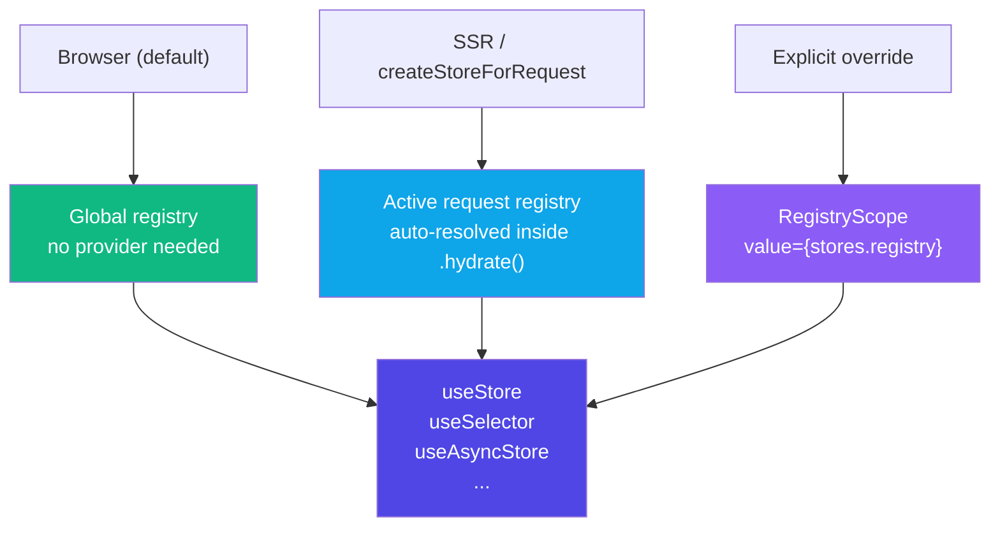
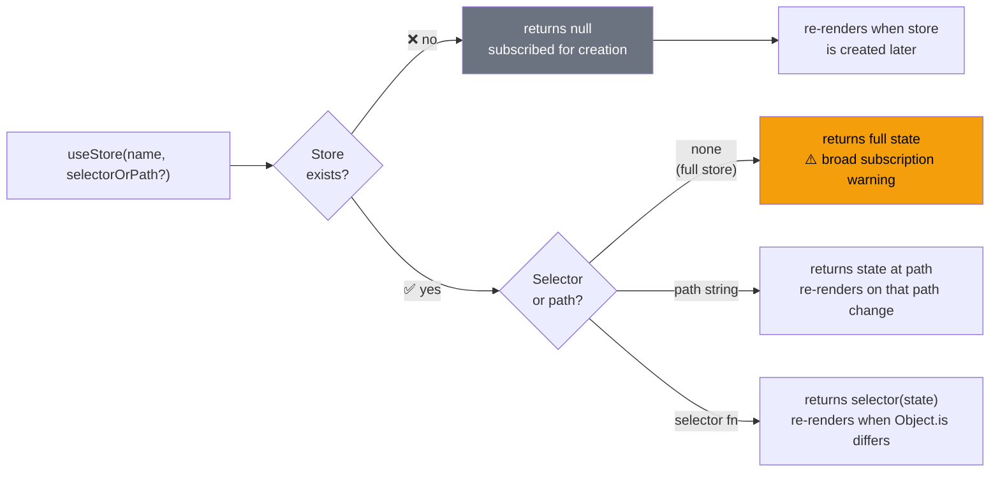
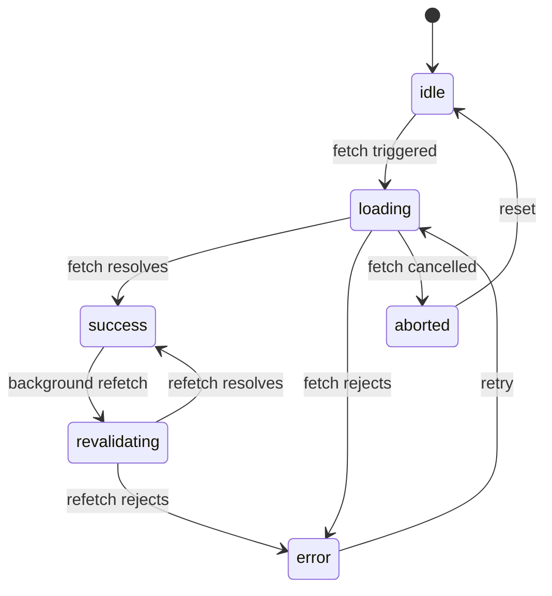
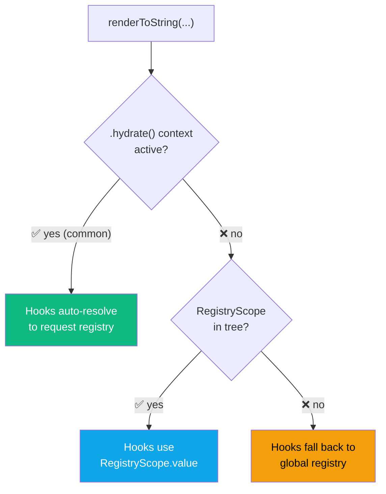

# ⚛️ React Layer Guide

> **Version:** 0.1.4 &nbsp;|&nbsp; **Last Updated:** 2026-04-02 &nbsp;|&nbsp; **Confidence:** 
>
> *Derived from `src/react/hooks-core.ts`, `hooks-async.ts`, `hooks-form.ts`, `hooks-async-suspense.ts`, `registry.ts`*

---

## 📚 Table of Contents

- [Setup](#-setup)
- [Hook Overview](#-hook-overview)
- [useStore](#-usestore)
  - [Stable Selectors](#stable-selectors)
- [useSelector](#-useselector)
- [useStoreField](#-usestorefield)
- [useStoreStatic](#-useStorestatic)
- [useAsyncStore](#-useasyncstore)
- [useFormStore](#-useformstore)
- [useAsyncStoreSuspense](#-useasyncstoresuspense)
- [Type Safety](#-type-safety)
  - [StoreStateMap Augmentation](#storestatemaps-augmentation)
  - [Typed Store Handles](#typed-store-handles)
- [SSR with RegistryScope](#-ssr-with-registryscope)

---

## ⚙️ Setup

```bash
npm install stroid
# React >= 18 is a peer dependency
```

```ts
import { useStore, useSelector } from "stroid/react"
```

> [!NOTE]
> **No provider required** for the default browser use case. Hooks connect directly to the global store registry. A `RegistryScope` is only needed for SSR or when you need to explicitly override the registry for a subtree — see [SSR with RegistryScope](#-ssr-with-registryscope).



---

## 🗺 Hook Overview

Choose the right hook for the job before diving into individual APIs:

| Hook | Re-renders on change? | Use case |
|---|---|---|
| `useStore` | ✅ Yes | Primary reactive reads — full store, path, or selector |
| `useSelector` | ✅ Yes (shallow equality) | Selectors returning new objects/arrays with same contents |
| `useStoreField` | ✅ Yes | Convenience alias for `useStore(name, field)` |
| `useStoreStatic` | ❌ No | One-time reads — analytics snapshots, initial values |
| `useAsyncStore` | ✅ Yes | Stores managed by `fetchStore` with loading/error state |
| `useFormStore` | ✅ Yes | Binding store fields to form inputs |
| `useAsyncStoreSuspense` | ✅ Yes (throws promise) | Suspense-compatible async stores |

---

## 🪝 `useStore`

The **primary hook** for reactive store reads. Subscribes to a store and re-renders the component only when the relevant slice of state changes.

> [!NOTE]
> `useStore(...)` and `useSelector(...)` are built on React's `useSyncExternalStore`. The current hook layer is locally certified against no-tearing invariants under `useTransition` and `useDeferredValue` via the React concurrency regression and benchmark harness.

### Three calling styles:

```tsx
// 1. Full store — re-renders on ANY change to the store
//    ⚠️ Dev warning if used without a path or selector (broad subscription)
const user = useStore("user")

// 2. Path — re-renders only when "profile.role" changes
const role = useStore("user", "profile.role")

// 3. Selector — re-renders only when the selector's return value changes (Object.is)
const isAdmin = useStore("user", s => s.role === "admin")

// 4. Selector + custom equality — for non-primitive return values
const ids = useStore("cart", s => s.items.map(i => i.id), shallowEqual)
```

> [!NOTE]
> Returns `null` if the store does not yet exist. The component will **automatically re-render** and receive the real value once the store is created — no polling or manual retry needed.



---

### Stable Selectors

Inline selectors are **re-created on every render**, which causes selector identity churn — Stroid can't reuse the previous selector result and must re-evaluate on every render cycle.

```tsx
// ❌ Inline — new function reference every render
const total = useStore("cart", s => s.items.length)

// ✅ Defined outside the component — stable reference
const selectItemCount = (s: CartState) => s.items.length
function CartBadge() {
  const total = useStore(cartStore, selectItemCount)
  return <span>{total}</span>
}

// ✅ useCallback — stable when deps don't change
function CartBadge({ minPrice }: { minPrice: number }) {
  const selectExpensive = useCallback(
    (s: CartState) => s.items.filter(i => i.price > minPrice).length,
    [minPrice]
  )
  const count = useStore(cartStore, selectExpensive)
  return <span>{count}</span>
}
```

> [!WARNING]
> Inline selectors trigger a **dev-only warning** about selector identity churn. The subscription itself remains correct and stable — but selector cache reuse is lost, and selector work runs on every render rather than only when state changes. In performance-sensitive trees, this adds up.

<details>
<summary>🧠 <strong>Why selector identity matters — the memoization model</strong></summary>

Stroid caches the last selector result per subscription. When state changes, it runs the selector and compares the new result to the cached result using `Object.is` (or your custom equality). If they're equal, the component does **not** re-render.

This cache is keyed to the selector function's **reference identity**. A new function reference (a new inline arrow function) busts the cache on every render — even if the function body is identical — so the component re-renders whenever *any* part of the store changes, regardless of whether the selected value changed.

```
Render 1: useStore(store, s => s.count)   // fn ref = A → cache miss → run selector
Render 2: useStore(store, s => s.count)   // fn ref = B (new!) → cache miss → run selector again
Render 3: useStore(store, s => s.count)   // fn ref = C (new!) → cache miss → run selector again
```

vs.

```
Render 1: useStore(store, selectCount)    // fn ref = selectCount → cache miss → run selector
Render 2: useStore(store, selectCount)    // fn ref = selectCount → cache HIT if state unchanged
Render 3: useStore(store, selectCount)    // fn ref = selectCount → cache HIT if state unchanged
```

</details>

---

## 🔍 `useSelector`

Like `useStore` with a selector, but uses **`shallowEqual`** as the default equality check instead of `Object.is`. This makes it ideal for selectors that return new object or array references with the same *contents* on every call.

```tsx
import { useSelector } from "stroid/react"

function CartSummary() {
  const { count, total } = useSelector("cart", s => ({
    count: s.items.length,
    total: s.items.reduce((acc, i) => acc + i.price, 0),
  }))
  // Only re-renders when count or total actually changes — not on every cart write
  return <div>{count} items — ${total}</div>
}
```

**`useStore` vs `useSelector` equality comparison:**

| | `useStore` (default) | `useSelector` (default) |
|---|---|---|
| Equality function | `Object.is` | `shallowEqual` |
| Primitives (`string`, `number`, `boolean`) | ✅ Correct | ✅ Correct |
| New object with same fields | ❌ Re-renders (different reference) | ✅ No re-render |
| New array with same items | ❌ Re-renders | ✅ No re-render (shallow) |
| Nested objects | ❌ Re-renders (shallow mismatch) | ❌ Re-renders (shallow only) |

> [!TIP]
> Use `useSelector` when your selector returns a derived object or array (like a computed summary) that is reconstructed on every call but has the same shallow content. Use `useStore` with a custom equality function for deep comparison needs.

---

## 🏷 `useStoreField`

A **convenience alias** for `useStore(name, field)`. Reads a single named field from a store reactively.

```tsx
import { useStoreField } from "stroid/react"

function ProfileName() {
  const name = useStoreField("user", "profile.name")
  // Equivalent to: useStore("user", "profile.name")
  return <span>{name}</span>
}
```

> [!TIP]
> Prefer `useStoreField` when you're reading a single scalar field and want the call site to be self-documenting. There is no behaviour difference from `useStore(name, field)`.

---

## 📌 `useStoreStatic`

Reads a store **once** without subscribing. The component will **not** re-render when the store changes after the initial read.

```tsx
import { useStoreStatic } from "stroid/react"

function TrackInitialSettings() {
  const initial = useStoreStatic("settings")

  useEffect(() => {
    analytics.track("session_start", { settings: initial })
  }, [])   // ← stable — initial never changes after mount

  return null
}
```

> [!WARNING]
> `useStoreStatic` is intentionally non-reactive. Do not use it for values that should drive UI rendering — the component will show stale state as the store updates. Reserve it for fire-and-forget reads: analytics snapshots, logging initial values, or seeding non-reactive local state.

<details>
<summary>🧠 <strong>When static reads beat reactive ones — performance cases</strong></summary>

Reactive subscriptions have a small per-component cost: each `useStore` call registers a listener that evaluates on every relevant store change. In most components this is negligible. But in a few scenarios, a static read is the right tool:

| Scenario | Why static is better |
|---|---|
| Analytics / logging on mount | You want exactly the value at mount time — reacting to changes would re-log |
| Seeding uncontrolled form state (`defaultValue`) | `defaultValue` is read once by the DOM — re-renders don't help |
| `useRef`-based caches or sentinels | You need the value once to initialise, then manage state yourself |
| Thousands of list items reading the same config | Eliminates N subscriptions for a store that rarely changes |

</details>

---

## ⏳ `useAsyncStore`

For stores managed by `fetchStore`. Returns a structured async snapshot with all the state you need to render loading, error, empty, and success states:

```tsx
import { useAsyncStore } from "stroid/react"

function UserCard() {
  const { data, loading, error, status, isEmpty, revalidating } = useAsyncStore("user")

  if (loading)      return <Spinner />
  if (error)        return <ErrorBanner message={error} />
  if (isEmpty)      return <EmptyState />
  if (revalidating) return <UserCardUI user={data} stale />
  return <UserCardUI user={data} />
}
```

**Return shape:**

| Field | Type | Description |
|---|---|---|
| `data` | `T \| null` | The fetched value — available even while revalidating |
| `loading` | `boolean` | `true` during the **initial** load only |
| `revalidating` | `boolean` | `true` during **background** revalidation (data is still available) |
| `error` | `string \| null` | Error message if the last fetch failed |
| `status` | `"idle" \| "loading" \| "success" \| "error" \| "aborted"` | Full lifecycle status |
| `isEmpty` | `boolean` | `data == null && !loading && !error` — convenient null-state check |

**Lifecycle state machine:**



> [!TIP]
> `loading` and `revalidating` are intentionally separate. `loading` is only `true` during the **first** fetch — when there's no data yet. `revalidating` is `true` during background refreshes — data is already available and the UI can keep showing it. This lets you build skeleton screens for first load and subtle refresh indicators for subsequent ones.

<details>
<summary>🧠 <strong>Rendering patterns for each async state</strong></summary>

```tsx
function UserCard() {
  const { data, loading, error, isEmpty, revalidating } = useAsyncStore("user")

  // Pattern 1: Hard loading gate (blank until first data)
  if (loading) return <Skeleton />

  // Pattern 2: Soft revalidation (show stale data + spinner overlay)
  return (
    <div className={revalidating ? "opacity-60" : ""}>
      {revalidating && <RefreshSpinner />}
      {error   && <InlineError message={error} />}
      {isEmpty && <EmptyState />}
      {data    && <UserCardUI user={data} />}
    </div>
  )
}
```

Pattern 2 gives a much smoother experience for returning users — the page never goes blank on a background refresh, and the stale data is still useful while the fresh data loads.

</details>

---

## 📝 `useFormStore`

Binds a store field directly to a **form input**. Returns a `{ value, onChange }` pair ready to spread onto an input element.

```tsx
import { useFormStore } from "stroid/react"

function NameInput() {
  const { value, onChange } = useFormStore("profile", "name")
  return <input value={value ?? ""} onChange={onChange} />
}

function OptInCheckbox() {
  const { value, onChange } = useFormStore("prefs", "emailOptIn")
  return <input type="checkbox" checked={value ?? false} onChange={onChange} />
}
```

**`onChange` accepts two forms:**

| Input type | What `onChange` receives | How it extracts the value |
|---|---|---|
| Text / number / select | React `SyntheticEvent` | `e.target.value` |
| Checkbox | React `SyntheticEvent` | `e.target.checked` |
| Custom / programmatic | Raw value directly | Used as-is |

> [!TIP]
> `useFormStore` eliminates the `value` + `onChange` boilerplate for store-backed inputs. The store is updated on every keystroke — it's a controlled input pattern where the store *is* the form state. If you need debouncing, wrap the `onChange` with a debounce before passing it, or use middleware to throttle writes.

> [!NOTE]
> `value` can be `null` if the store doesn't exist yet or the path is missing. Always provide a fallback (`value ?? ""`) to keep inputs controlled rather than switching between controlled and uncontrolled modes.

---

## 🌀 `useAsyncStoreSuspense`

A **Suspense-compatible** version of `useAsyncStore`. Throws a Promise while loading (which React catches at the nearest `Suspense` boundary), then returns the resolved data directly.

```tsx
import { useAsyncStoreSuspense } from "stroid/react"

// This component never has to handle loading state — Suspense does it
function UserName() {
  const name = useAsyncStoreSuspense("user", "/api/user", {
    ttl: 30_000,
    autoCreate: true,
  })
  return <span>{name}</span>  // ← name is always defined here
}

// Wrap in a Suspense boundary in the parent:
function App() {
  return (
    <React.Suspense fallback={<Spinner />}>
      <ErrorBoundary fallback={<ErrorPage />}>
        <UserName />
      </ErrorBoundary>
    </React.Suspense>
  )
}
```

> [!WARNING]
> `useAsyncStoreSuspense` **must** be wrapped in a `React.Suspense` boundary. Without one, the thrown Promise will propagate uncaught and crash the React tree. Always pair it with an `ErrorBoundary` too — fetch errors are thrown as errors, not returned as values.

> [!TIP]
> Use `useAsyncStoreSuspense` when you want the **simplest possible component** — no conditional rendering, no `if (loading)` branches. Use `useAsyncStore` when you want fine-grained control over loading and revalidation UI (e.g. skeleton screens, stale-while-revalidate indicators).

<details>
<summary>🧠 <strong>Suspense vs. useAsyncStore — when to use each</strong></summary>

| Concern | `useAsyncStore` | `useAsyncStoreSuspense` |
|---|---|---|
| Loading UI | Rendered by the component | Rendered by `<Suspense fallback>` |
| Error UI | Rendered by the component | Rendered by `<ErrorBoundary>` |
| Revalidation indicator | `revalidating` field available | Not available — need `useAsyncStore` for that |
| Component complexity | Higher (branching logic) | Lower (data always available) |
| Parallel data loading | Requires manual coordination | Waterfall-free when used with `React.use` patterns |
| Best for | Feature components with custom loading states | Leaf components, data-display-only components |

A common pattern: use `useAsyncStoreSuspense` for deep leaf components and `useAsyncStore` at the page or section level where you want to control the loading skeleton layout.

</details>

---

## 🔒 Type Safety

### `StoreStateMap` Augmentation

The fastest path to **fully typed hooks across your entire app**. Declare your stores once in a `.d.ts` file:

```ts
// src/stroid.d.ts
declare module "stroid" {
  interface StoreStateMap {
    user: {
      name:    string
      role:    "admin" | "user"
      profile: { bio: string; avatar: string }
    }
    cart: {
      items: Array<{ id: string; price: number }>
    }
  }
}
```

All hooks are now fully typed automatically:

```ts
const role  = useStore("user", "role")    // → "admin" | "user" | null
const items = useStore("cart", "items")   // → Array<{ id: string; price: number }> | null
const count = useSelector("cart", s => s.items.length)  // → number | null
```

> [!TIP]
> Without `StoreStateMap` augmentation, Stroid emits a **once-per-store** dev warning about untyped store names. Suppress it without adding types via `configureStroid({ acknowledgeLooseTypes: true })` — but prefer fixing the types properly.

---

### Typed Store Handles

For per-store type safety **without global augmentation** — ideal for feature modules or library code:

```ts
import { store } from "stroid"

const cartStore = store<"cart", { items: CartItem[] }>("cart")

// All hooks fully typed via the handle:
const items = useStore(cartStore, "items")            // → CartItem[] | null
const count = useSelector(cartStore, s => s.items.length)  // → number | null
const { value, onChange } = useFormStore(cartStore, "discount")
```

> [!NOTE]
> A handle is a lightweight branded wrapper around the store name. It has zero runtime overhead. Use it in modules where you want local type safety without adding entries to a global `.d.ts`.

---

## 🖥 SSR with `RegistryScope`

For server-side rendering with `createStoreForRequest`, hooks automatically resolve to the **active request registry** when rendered inside `.hydrate()` — no `RegistryScope` required for the common case.

```tsx
import { RegistryScope } from "stroid/react"

const stores = createStoreForRequest((api) => {
  api.create("user", sessionUser)
  api.create("cart", sessionCart)
})

// Hooks inside .hydrate() automatically use the request registry:
stores.hydrate(() => {
  return renderToString(<App />)
})
```

Use `RegistryScope` explicitly when you need to **render outside** `.hydrate()` or **override** the registry for a specific subtree:

```tsx
stores.hydrate(() => {
  return renderToString(
    <RegistryScope value={stores.registry}>
      <App />
    </RegistryScope>
  )
})
```



> [!WARNING]
> If hooks fall back to the **global registry** during SSR (bottom-right path above), they may read shared global state rather than the per-request state you created with `createStoreForRequest`. This causes **state leakage between concurrent requests** — a serious bug in production SSR. Always render inside `.hydrate()` or an explicit `RegistryScope`.

<details>
<summary>🧠 <strong>Why the auto-resolution exists — and when RegistryScope is still needed</strong></summary>

`createStoreForRequest(...).hydrate(fn)` sets a short-lived async context (via AsyncLocalStorage in Node.js environments) that all Stroid hooks resolve against during the synchronous render pass. This means you don't need to manually thread the registry through every component tree.

`RegistryScope` is needed in three cases:

1. **Rendering outside `.hydrate()`** — e.g. in a test environment where you want to provide a specific registry to a component without calling `.hydrate()`
2. **Nested registries** — e.g. a route-level sub-tree that should use a different store scope than the page-level tree
3. **Streaming SSR (`renderToPipeableStream`)** — async context may not propagate correctly through async streaming boundaries; `RegistryScope` makes the registry explicit in the React tree instead of relying on the async context

In practice, most apps only need `.hydrate()` and never touch `RegistryScope` directly.

</details>

---

*© Stroid Docs — Generated 2026-03-29*
