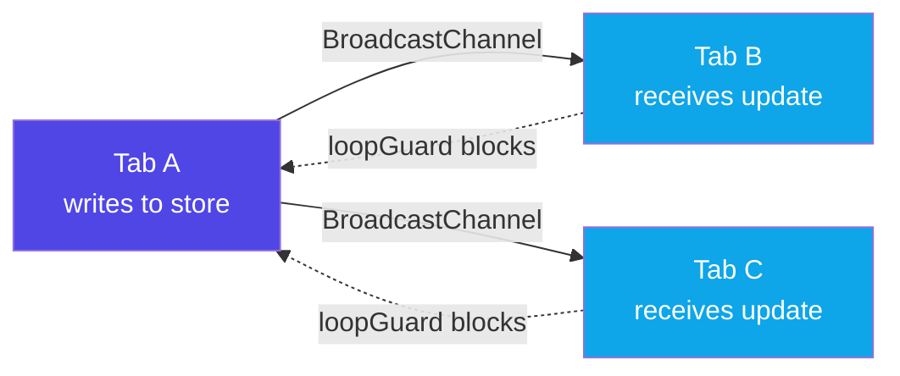
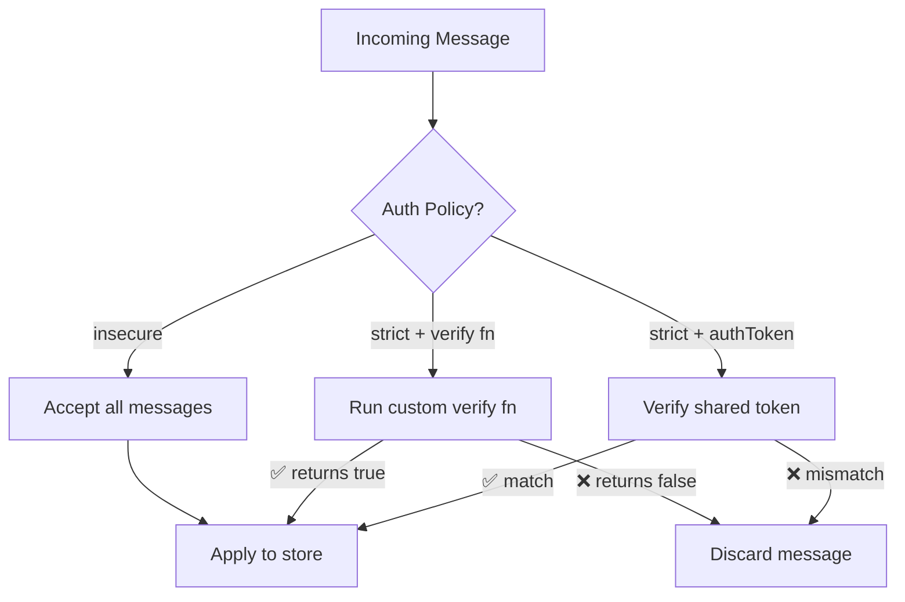
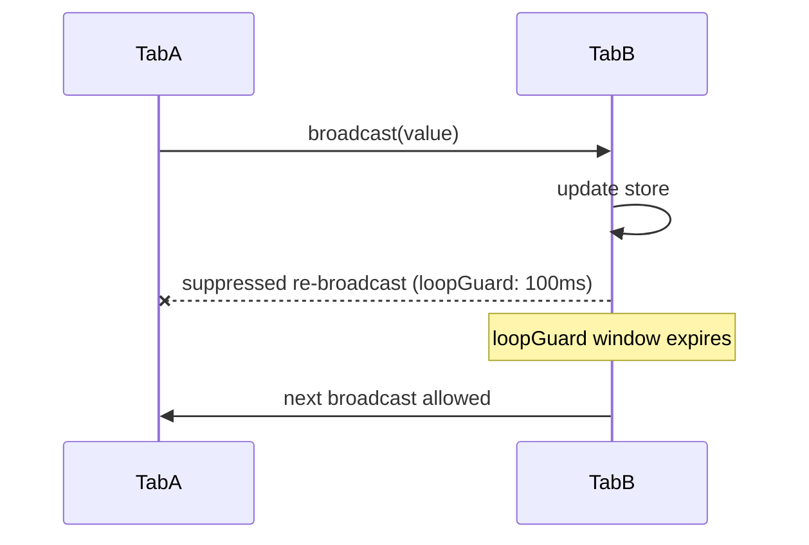
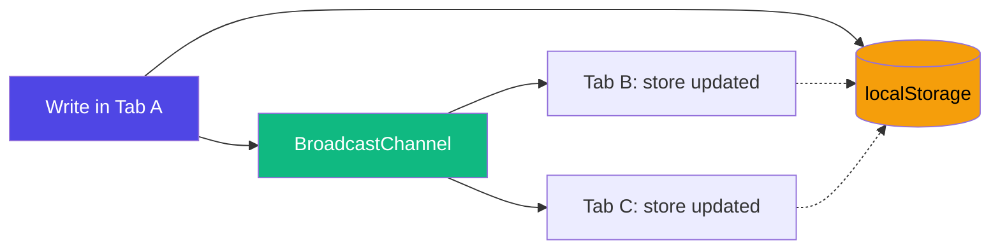

# 🔄 Cross-Tab Sync

<!-- Metadata -->
> **Version:** 1.0 &nbsp;|&nbsp; **Last Updated:** 2026-03-29 &nbsp;|&nbsp; **Confidence:** 
> 
> *Derived from `src/features/sync.ts`, `src/adapters/options.ts` (`SyncOptions`)*

---

## 📚 Table of Contents

- [Overview](#-overview)
- [Setup](#-setup)
- [Basic Usage](#-basic-usage)
- [Security](#-security)
- [Conflict Resolution](#-conflict-resolution)
- [Loop Guard](#-loop-guard)
- [Payload Size Limit](#-payload-size-limit)
- [Checksum](#-checksum)
- [Persist + Sync Together](#-persist--sync-together)
- [Availability & Edge Cases](#-availability--edge-cases)
- [SyncOptions Reference](#-syncoptions-reference)

---

## 🗺 Overview

Cross-tab sync lets multiple browser tabs share state in real time over a [`BroadcastChannel`](https://developer.mozilla.org/en-US/docs/Web/API/BroadcastChannel). When one tab writes to a store, every other tab with the same `channel` receives the update instantly — no server round-trip needed.



> [!NOTE]
> `BroadcastChannel` is **same-origin only**. Tabs from different origins cannot communicate through this mechanism.

---

## ⚙️ Setup

Install the sync feature **once** at your app's entry point, before any store is created.

```ts
// main.tsx
import { installSync } from "stroid/sync"

installSync()
```

> [!WARNING]
> Without calling `installSync()`, any store configured with `sync` options will **silently do nothing**.
> If you prefer an explicit error, enable `strictMissingFeatures: true` in your global config — it will throw instead of failing silently.

> [!TIP]
> Think of `installSync()` like registering a plugin. It wires up the internal `BroadcastChannel` machinery once so all subsequent stores can use it. Call it early — ideally before any `createStore()` call.

---

## 🚀 Basic Usage

```ts
import { createStore } from "stroid"
import { installSync } from "stroid/sync"

installSync()

createStore("presence", { online: true }, {
  sync: {
    channel:   "app-presence",
    authToken: "shared-secret",
  }
})
```

Any write to the `"presence"` store in one tab is instantly broadcast to **all other tabs** listening on the same channel. Stale or out-of-order messages are automatically discarded using a **Lamport clock** — so you don't have to worry about old updates overwriting newer ones.

<details>
<summary>🧠 <strong>How Lamport clocks work here</strong></summary>

A Lamport clock is a simple logical counter. Each write increments the clock. When a message arrives from another tab, Stroid compares its clock value to the local one:

- **Incoming clock > local clock** → accept the update
- **Incoming clock ≤ local clock** → reject as stale

This guarantees **causal ordering** across tabs without needing synchronized wall clocks.

```
Tab A: write(clock=3) ──────────────────────────────► Tab B: clock=3, accept ✅
Tab A: write(clock=2) [delayed/retried] ────────────► Tab B: clock=2 < 3, reject ❌
```

</details>

---

## 🔐 Security

By default, unauthenticated sync in production is **blocked** (`policy: "strict"`). You must explicitly choose an auth strategy:



### Option 1 — Shared Token ✅ Recommended for most apps

```ts
sync: {
  channel:   "presence-sync",
  authToken: "app-shared-token",
}
```

### Option 2 — Custom Verification 🧠 For advanced auth (e.g. HMAC)

```ts
sync: {
  channel: "presence-sync",
  sign:    (msg) => hmac(msg, secret),
  verify:  (msg) => verifyHmac(msg, secret),
}
```

### Option 3 — Insecure ⚠️ Explicit opt-out

```ts
sync: {
  channel: "public-ui-sync",
  policy:  "insecure",   // also: deprecated `insecure: true`
}
```

> [!WARNING]
> `BroadcastChannel` is same-origin, but it provides **no isolation within that origin**. If any tab is XSS-compromised, it can forge sync messages on any channel.
> 
> `authToken` and `verify` offer meaningful — though not absolute — protection against forged messages within a compromised origin.

> [!TIP]
> Use `policy: "insecure"` only for non-sensitive UI state like theme preferences, panel layouts, or tooltip visibility. For anything user-specific or privileged, always use `authToken` or a `verify` function.

---

## ⚖️ Conflict Resolution

When two tabs write **simultaneously**, Stroid defaults to **higher clock wins**. You can override this with a custom resolver:

```ts
sync: {
  channel: "presence",
  conflictResolver: ({ local, incoming, localUpdated, incomingUpdated }) => {
    // Return the value to use.
    // Return void to fall back to the default (higher Lamport clock wins).
    return localUpdated > incomingUpdated ? local : incoming
  }
}
```

<details>
<summary>🧠 <strong>When to write a custom resolver</strong></summary>

The default (higher-clock-wins) is correct for most cases. You may want a custom resolver when:

| Scenario | Custom resolver approach |
|---|---|
| Last-write-wins by **wall clock** | Compare `localUpdated` vs `incomingUpdated` timestamps |
| **Merge** two objects (e.g. presence maps) | Deep-merge `local` and `incoming` |
| Domain-specific priority (e.g. "offline always loses") | Check a `status` field in the value |

Be careful: a resolver that always picks `local` will effectively make a tab deaf to remote changes.

</details>

---

## 🔁 Loop Guard

When a sync update triggers a local reaction that re-broadcasts, you can end up in a rapid feedback loop across tabs. `loopGuard` is your protection:



`loopGuard` is **enabled by default** with a 100ms suppression window.

```ts
// Default — 100ms window
sync: { channel: "presence" }

// Custom window
sync: {
  channel:   "presence",
  loopGuard: { windowMs: 200 },
}

// Disabled — use only if you need immediate re-broadcast
sync: {
  channel:   "presence",
  loopGuard: false,
}
```

> [!WARNING]
> Disabling `loopGuard` in stores where a write can trigger another write (e.g. via middleware or subscriptions) can cause **infinite broadcast storms** across tabs. Only disable it when you are certain the reaction chain terminates.

---

## 📦 Payload Size Limit

Reject oversized messages before they are applied to the store:

```ts
sync: {
  channel:         "settings-sync",
  maxPayloadBytes: 64_000,   // messages larger than this are silently dropped
}
```

> [!TIP]
> This is especially useful in shared-workspace apps where a rogue or misconfigured tab might accidentally broadcast a huge payload (e.g. a blob or serialized DOM tree). Setting a sensible limit keeps sync fast and predictable.

---

## 🔎 Checksum

Stroid can include a payload checksum to detect data corruption in-flight:

```ts
sync: {
  channel:  "data-sync",
  checksum: "hash",    // default: include a checksum
}

// Disable checksum for performance-sensitive, high-frequency channels
sync: {
  channel:  "cursor-position-sync",
  checksum: "none",
}
```

> [!NOTE]
> `checksum: "hash"` adds a lightweight integrity check to each message. For high-frequency stores (e.g. mouse coordinates, scroll positions), consider `"none"` to reduce overhead.

---

## 💾 Persist + Sync Together

`persist` and `sync` compose cleanly. A write in any tab is both saved to `localStorage` **and** broadcast to all other tabs:

```ts
import { installPersist } from "stroid/persist"
import { installSync }    from "stroid/sync"

installPersist()
installSync()

createStore("settings", { theme: "dark" }, {
  persist: { key: "app-settings", allowPlaintext: true },
  sync:    { channel: "settings-sync", authToken: "token" },
})
```



> [!TIP]
> With both features active, a freshly opened tab will **hydrate from `localStorage`** (persist) and then stay in sync via `BroadcastChannel` (sync) — giving you both durability and live consistency.

---

## 🌐 Availability & Edge Cases

| Environment / Condition | Behavior |
|---|---|
| Safari Private Mode | `BroadcastChannel` unavailable — Stroid warns and **no-ops** gracefully |
| Node.js (no polyfill) | Same as above — no-op with warning |
| `scope: "temp"` store | Sync is **automatically disabled** |
| Tab stored in BFCache | Open `BroadcastChannel` may reduce BFCache restore success |

> [!WARNING]
> **BFCache note:** Keeping a `BroadcastChannel` open can prevent instant back/forward cache restoration. In browsers that report BFCache blocking reasons, this may appear as `broadcastchannel-message`. If your app is highly sensitive to back/forward navigation performance, test sync-enabled pages with your browser's BFCache diagnostics tool.

---

## 📋 SyncOptions Reference

| Option | Type | Default | Description |
|---|---|---|---|
| `channel` | `string` | store name | `BroadcastChannel` name shared across tabs |
| `authToken` | `string` | — | Shared token for lightweight message authentication |
| `policy` | `"strict" \| "insecure"` | `"strict"` | Auth enforcement policy |
| `sign` | `(msg) => unknown` | — | Custom message signer (pairs with `verify`) |
| `verify` | `(msg) => boolean` | — | Custom message verifier (pairs with `sign`) |
| `conflictResolver` | `fn` | higher-clock wins | Override default Lamport-clock conflict resolution |
| `loopGuard` | `boolean \| { windowMs }` | `true` (100ms) | Suppresses re-broadcast loops within the window |
| `maxPayloadBytes` | `number` | — | Reject messages exceeding this byte size |
| `checksum` | `"hash" \| "none"` | `"hash"` | Payload integrity check mode |
| `insecure` | `boolean` | — |  Use `policy: "insecure"` instead |

---

<details>
<summary>⚠️ <strong>Deprecated Options</strong></summary>

| Option | Replacement | Notes |
|---|---|---|
| `insecure: true` | `policy: "insecure"` | Still functional but will be removed in a future major version |

</details>

---

*© Stroid Docs — Generated 2026-03-29*