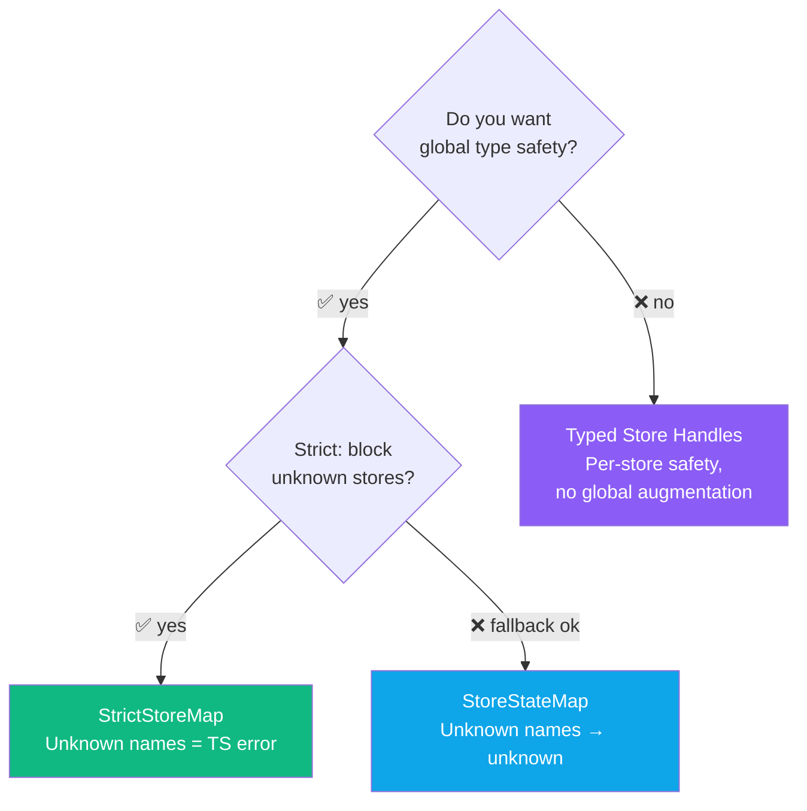
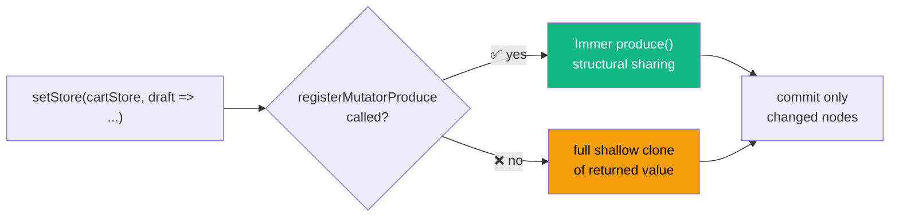
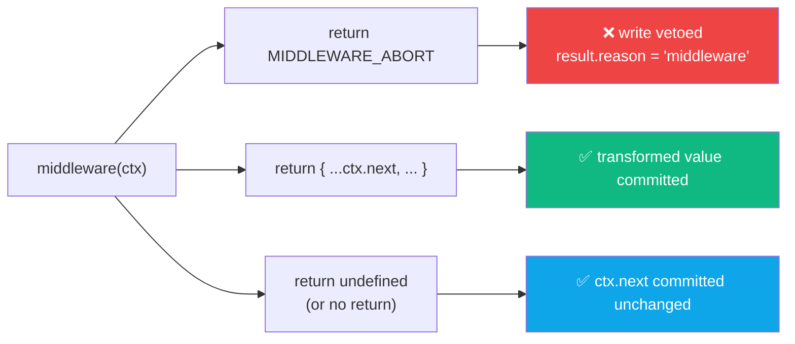

# 🧩 TypeScript & Advanced Patterns

> **Version:** 1.0 &nbsp;|&nbsp; **Last Updated:** 2026-03-29 &nbsp;|&nbsp; **Confidence:** 
>
> *Derived from `src/core/store-lifecycle/types.ts`, `src/adapters/options.ts`, and source-code type signatures.*

---

## 📚 Table of Contents

- [Type Safety Overview](#-type-safety-overview)
- [Typed Store Names — Module Augmentation](#-typed-store-names--module-augmentation)
- [Strict Store Map](#-strict-store-map)
- [Typed Store Handles](#-typed-store-handles)
- [HydrateSnapshotFor](#-hydratesnapshotfor)
- [Path Types](#-path-types)
- [Feature Options Augmentation](#-feature-options-augmentation)
- [WriteResult](#-writeresult)
- [SSR Typed APIs](#-ssr-typed-apis)
- [Immer Integration](#-immer-integration)
- [Middleware Pattern](#-middleware-pattern)
- [Suppress Loose-Type Warnings](#-suppress-loose-type-warnings)

---

## 🗺 Type Safety Overview

Stroid offers **three graduated levels** of TypeScript integration. Choose the one that fits your project's needs:



| Approach | Setup | Unknown store name | Best for |
|---|---|---|---|
| `StoreStateMap` augmentation | Global `.d.ts` | Falls back to `unknown` | Most projects |
| `StrictStoreMap` augmentation | Global `.d.ts` | **TypeScript error** | Strictly typed monorepos |
| Typed store handles (`store<>()`) | Per-store | N/A — no string access | Lib authors, isolated modules |

> [!TIP]
> Start with `StoreStateMap`. Upgrade to `StrictStoreMap` once your team is comfortable — it eliminates a whole class of typo bugs at the call site.

---

## 🔤 Typed Store Names — Module Augmentation

The cleanest path to **full type safety for string-based store access** across your entire app. Declare your stores once in a `.d.ts` file, and every API call becomes typed automatically.

**Step 1 — Create a declaration file:**

```ts
// src/stroid.d.ts  (or any .d.ts file in your project)
declare module "stroid" {
  interface StoreStateMap {
    user: {
      name:    string
      role:    "admin" | "user"
      profile: { bio: string; avatar: string }
    }
    cart: {
      items:    Array<{ id: string; price: number; name: string }>
      discount: number
    }
  }
}
```

**Step 2 — All string-based APIs are now typed:**

```ts
getStore("user", "profile.bio")          // ✅ → string | null
setStore("user", "role", "admin")        // ✅ literal type checked
setStore("user", "role", "superuser")    // ❌ TypeScript error
useStore("cart", s => s.items.length)    // ✅ → number | null
```

> [!NOTE]
> No runtime cost. Module augmentation is a purely compile-time TypeScript feature — Stroid's runtime is unaffected. The `.d.ts` file can live anywhere TypeScript can find it; `src/stroid.d.ts` is a conventional location.

<details>
<summary>🧠 <strong>How module augmentation works under the hood</strong></summary>

TypeScript's module augmentation lets you extend an existing module's interface declarations from another file. Stroid ships with an empty `StoreStateMap` interface:

```ts
// Stroid's own types (simplified):
export interface StoreStateMap {}

export function getStore<K extends keyof StoreStateMap>(
  name: K,
  path?: Path<StoreStateMap[K]>
): PathValue<StoreStateMap[K], ...> | null
```

When you augment `StoreStateMap` with your own entries, TypeScript merges the interfaces at compile time. `getStore("user")` now has concrete return types without any code change in Stroid itself.

This is the same technique used by React Router's `RouteObject` map and Prisma's generated client types.

</details>

---

## 🔒 Strict Store Map

For the strongest enforcement — **unknown store names become TypeScript errors** at the call site:

```ts
// src/stroid.d.ts
declare module "stroid" {
  interface StrictStoreMap {
    user: UserState
    cart: CartState
  }
}
```

```ts
getStore("user")     // ✅ typed as UserState | null
getStore("unknown")  // ❌ TypeScript error — "unknown" is not a key of StrictStoreMap
```

**Comparing the two approaches:**

| Behaviour | `StoreStateMap` | `StrictStoreMap` |
|---|---|---|
| Known store names | Fully typed ✅ | Fully typed ✅ |
| Unknown store names | Falls back to `unknown` | **TypeScript error** ❌ |
| Refactor safety | Partial | Complete |
| Migration effort | Low | Higher — all stores must be declared |

> [!WARNING]
> You cannot declare both `StoreStateMap` and `StrictStoreMap` simultaneously — Stroid uses one or the other. If both are augmented, `StrictStoreMap` takes precedence.

> [!TIP]
> `StrictStoreMap` is ideal for large monorepos where store names are owned by a single team. For plugin-based architectures where third-party code creates stores dynamically, `StoreStateMap` (with fallback to `unknown`) is more practical.

---

## 🔑 Typed Store Handles

Per-store type safety **without global augmentation** — ideal for library authors, feature-sliced codebases, or any situation where you want type safety scoped to a single module:

```ts
import { store } from "stroid"

const cartStore = store<"cart", CartState>("cart")
```

The returned handle carries the store name and state type as generics. Pass it to any API for full inference:

```ts
setStore(cartStore, draft => {
  draft.items.push(newItem)  // ✅ draft is CartState
})

getStore(cartStore, "items")       // ✅ → CartState["items"] | null
useStore(cartStore, s => s.items)  // ✅ → CartState["items"] | null
```

> [!NOTE]
> A handle is a lightweight branded object — essentially a typed wrapper around the store name string. It carries zero runtime overhead beyond a single object allocation.

<details>
<summary>🧠 <strong>Handles vs. augmentation: when to use each</strong></summary>

| Scenario | Recommended approach |
|---|---|
| App-wide stores (`user`, `cart`, `settings`) | `StoreStateMap` augmentation — one declaration, typed everywhere |
| Library publishing its own stores | Typed handles — no `.d.ts` pollution for consumers |
| Feature-sliced module with private stores | Typed handles — scope type safety to the module boundary |
| Stores created dynamically at runtime | Typed handles with a type parameter — augmentation can't cover dynamic names |

You can mix both in the same project: augment global stores with `StoreStateMap`, and use handles for module-local or dynamic stores.

</details>

---

## 💧 `HydrateSnapshotFor`

Compute a **typed snapshot shape** from your `StoreStateMap` — useful for server-side rendering where you need a typed partial snapshot to pass to the client:

```ts
import type { HydrateSnapshotFor, StoreStateMap } from "stroid"

type ServerSnapshot = HydrateSnapshotFor<StoreStateMap>
// Equivalent to: Partial<{ user: UserState; cart: CartState; ... }>
```

Use it to type the hydration call end-to-end:

```ts
// server.ts
const snapshot: ServerSnapshot = {
  user: { name: "Ava", role: "admin", profile: { bio: "...", avatar: "..." } },
  // cart is optional — Partial<> means you only include what you have
}

hydrateStores<ServerSnapshot>(snapshot, {}, { allowTrusted: true })
```

> [!TIP]
> `HydrateSnapshotFor` uses `Partial<>` so you don't need to provide every store in the snapshot. This matches SSR reality — you typically only hydrate a subset of stores from the server.

---

## 🛣 Path Types

Stroid exports utility types for working with **typed deep paths** into your store state:

```ts
import type { Path, PathValue } from "stroid"

type UserPaths = Path<UserState>
// → "name" | "role" | "profile" | "profile.bio" | "profile.avatar"

type BioValue = PathValue<UserState, "profile.bio">
// → string
```

**Default depth and customisation:**

```ts
import type { PathDepth } from "stroid"

// Default path depth is 10 levels.
// Override with PathDepth<T, N> for deeply nested state:
type DeepPaths = PathDepth<DeepState, 5>  // limit to 5 levels
```

> [!WARNING]
> Very deep path depths (above 10) can significantly increase TypeScript compile times for large state trees. If you notice slow completions, reduce `N` in `PathDepth` before filing a performance bug.

<details>
<summary>🧠 <strong>How path types are resolved</strong></summary>

`Path<T>` is a recursive conditional type that walks `T`'s property tree and produces a union of all dot-notation access strings. `PathValue<T, P>` resolves the type at a given path string using template literal types.

Both types short-circuit on non-object leaf nodes (`string`, `number`, `boolean`, `Date`, etc.) and respect array element types (`Array<Item>` exposes `${number}` paths for array positions).

This is the same technique used by React Hook Form's `FieldPath` and Zod's path utilities.

</details>

---

## 🔌 Feature Options Augmentation

Third-party plugins and custom features can extend the `FeatureOptionsMap` interface to add **typed feature options** to `createStore`:

```ts
// In your plugin's types file:
declare module "stroid" {
  interface FeatureOptionsMap {
    analytics: {
      trackName?: string
      enabled?:   boolean
    }
  }
}
```

Once augmented, `createStore` accepts and types the feature block:

```ts
createStore("user", { name: "Ava" }, {
  features: {
    analytics: { trackName: "user_store", enabled: true }  // ✅ fully typed
  }
})
```

> [!NOTE]
> `FeatureOptionsMap` follows the same module augmentation pattern as `StoreStateMap`. Plugin authors should ship their `.d.ts` augmentation alongside their plugin package so consumers get types automatically on install.

---

## 📋 `WriteResult`

Every Stroid write returns a structured `WriteResult` — **no thrown errors** on invalid input by default. This makes error handling explicit and exhaustive:

```ts
const result = setStore("user", "role", "unknown-role")

if (!result.ok) {
  switch (result.reason) {
    case "not-found":
      // Store hasn't been created yet
      break
    case "validate":
      // A validate rule rejected the value
      break
    case "path":
      // The path string was invalid or points at missing state
      break
    case "middleware":
      // A middleware returned MIDDLEWARE_ABORT
      break
    case "invalid-args":
      // Bad arguments passed to the write function
      break
    case "lazy-uninitialized":
      // Lazy store hasn't materialised yet
      break
  }
}
```

**All failure reasons at a glance:**

| Reason | Cause | Common fix |
|---|---|---|
| `not-found` | Store doesn't exist | Check store name / creation order |
| `validate` | Validate rule rejected the value | Inspect the validation config |
| `path` | Path is invalid or missing in state | Use `Path<T>` to catch typos at compile time |
| `middleware` | Middleware returned `MIDDLEWARE_ABORT` | Check middleware logic for the relevant action |
| `invalid-args` | Bad arguments (e.g. `undefined` store name) | Check call site arguments |
| `lazy-uninitialized` | Lazy store written before first read | Trigger a read first, or use an eager store |

> [!NOTE]
> `result.ok === true` is a type narrowing discriminant. TypeScript will narrow the result to the success shape (with your committed value) inside the `if (result.ok)` branch, and to the failure shape (with `reason` and optional `failedPatchId`) in the `else` branch.

> [!TIP]
> For fire-and-forget writes where you don't need the result, you can safely discard it — `WriteResult` is a plain value, not a Promise, and ignoring it has no side effects.

<details>
<summary>🧠 <strong>Why results instead of thrown errors?</strong></summary>

Thrown errors for invalid writes create several problems:

- They force every write call site into a `try/catch`, even when failures are expected (e.g. validation)
- They can't be exhaustively typed — `catch (e)` is always `unknown`
- In concurrent React trees, thrown errors during writes can be swallowed by error boundaries in unexpected places

`WriteResult` makes failure handling **opt-in and exhaustive**. The `switch` on `result.reason` is checked by TypeScript — if a new reason is added in a future version, your `switch` will produce a compile warning on the unhandled case (with `noImplicitReturns` enabled).

</details>

---

## 🖥 SSR Typed APIs

For server-side rendering, `stroid/server` exposes typed per-request store creation:

```ts
import type { StoreStateMap } from "stroid"
import { createStoreForRequest } from "stroid/server"

const stores = createStoreForRequest<StoreStateMap>((api) => {
  api.create("user", {           // ✅ "user" must be keyof StoreStateMap
    name: session.name,
    role: "admin",
    profile: { bio: "", avatar: "" }
  })
  api.create("cart", { items: [], discount: 0 })
})
```

> [!WARNING]
> `createStoreForRequest` creates an **isolated store scope** for the current request — stores created inside it are not shared with other requests. Never pass the resulting `stores` object across request boundaries.

> [!TIP]
> Pass `StoreStateMap` as the type parameter to `createStoreForRequest` to get fully typed `api.create` calls. Without it, `api.create` accepts any string with `unknown` state.

---

## 🧊 Immer Integration

Enable **structural sharing** in mutator-style writes by registering Immer's `produce`:

**Step 1 — Register once at app startup:**

```ts
import { produce } from "immer"
import { registerMutatorProduce } from "stroid"

registerMutatorProduce(produce)
```

**Step 2 — Write mutators naturally:**

```ts
setStore("cart", draft => {
  draft.items.push(newItem)        // ✅ Immer draft proxy
  draft.items[0].price = 99        // ✅ Only changed nodes are cloned
})
```



> [!NOTE]
> `registerMutatorProduce` is called **once** — it registers Immer globally for all `setStore` mutator calls in your app. There is no per-store opt-in; once registered, all mutators use Immer's draft proxies.

> [!TIP]
> Without Immer, Stroid's mutator mode clones the entire returned value. With Immer registered, **only the changed nodes are cloned** — a significant performance win for large, deeply nested state trees with frequent partial updates.

<details>
<summary>🧠 <strong>Immer drafts vs. plain mutators — performance trade-offs</strong></summary>

| Scenario | Without Immer | With Immer |
|---|---|---|
| Full state replacement (`return { ...state }`) | Same cost | Same cost (Immer adds slight overhead) |
| Partial nested update (`draft.a.b.c = x`) | Full clone of returned value | Only changed path cloned — O(depth) not O(size) |
| Large arrays, rare mutations | No difference | Structural sharing avoids re-rendering unchanged items |
| Very frequent small writes (e.g. cursor position) | Faster — no Immer proxy overhead | Slightly slower — Immer proxy setup cost |

Rule of thumb: register Immer if your state trees are deep or large and mutations are partial. Skip it if state is flat or writes always replace the whole value.

</details>

---

## 🔀 Middleware Pattern

Lifecycle middleware lets you **intercept, transform, or veto** any write to a store before it commits:

```ts
import { MIDDLEWARE_ABORT } from "stroid"

createStore("order", { items: [], status: "pending" }, {
  lifecycle: {
    middleware: [
      (ctx) => {
        // Veto the write — returns MIDDLEWARE_ABORT to reject:
        if (ctx.action === "set" && ctx.next.items.length > 50) {
          return MIDDLEWARE_ABORT
        }

        // Transform the value — return a modified next:
        return { ...ctx.next, updatedAt: Date.now() }

        // Pass through — return undefined (or omit return):
      }
    ]
  }
})
```

**The `ctx` object:**

| Field | Type | Description |
|---|---|---|
| `ctx.action` | `"set" \| "reset" \| "hydrate" \| "replace"` | The write operation type |
| `ctx.prev` | `StoreState` | The current committed value before this write |
| `ctx.next` | `StoreState` | The proposed new value |
| `ctx.path` | `string[]` | The path being written (empty `[]` for root writes) |
| `ctx.correlationId` | `string` | Trace ID for this write (if tracing is configured) |
| `ctx.traceContext` | `object \| undefined` | Full trace context (if configured) |

**Middleware return values:**



> [!WARNING]
> Middleware runs **synchronously inside the write pipeline** — do not perform async operations, trigger other store writes, or call `getStore` inside middleware. Side effects that cross the write boundary should use lifecycle `onCommit` hooks instead.

> [!TIP]
> Multiple middleware functions are applied **in array order**. Each middleware receives the `ctx.next` produced by the previous one — allowing composable transformations. `MIDDLEWARE_ABORT` from any middleware short-circuits the rest of the chain.

<details>
<summary>🧠 <strong>Practical middleware patterns</strong></summary>

**Audit logging:**
```ts
middleware: [
  (ctx) => {
    auditLog.record({ action: ctx.action, path: ctx.path, correlationId: ctx.correlationId })
    // return undefined → pass through
  }
]
```

**Immutable field enforcement:**
```ts
middleware: [
  (ctx) => {
    if (ctx.path.includes("id") && ctx.prev?.id !== undefined) {
      return MIDDLEWARE_ABORT  // id is write-once
    }
  }
]
```

**Automatic timestamps:**
```ts
middleware: [
  (ctx) => {
    if (ctx.action === "set" || ctx.action === "replace") {
      return { ...ctx.next, updatedAt: Date.now() }
    }
  }
]
```

**Composing multiple concerns:**
```ts
middleware: [auditMiddleware, immutableFieldMiddleware, timestampMiddleware]
// Each receives the output of the previous — compose freely.
```

</details>

---

## 🔇 Suppress Loose-Type Warnings

If you intentionally use string store names **without** `StoreStateMap` augmentation (e.g. in a prototype or migration phase), suppress the per-store dev warning:

```ts
import { configureStroid } from "stroid"

configureStroid({ acknowledgeLooseTypes: true })
```

> [!NOTE]
> This flag suppresses the **once-per-store** dev-mode warning emitted when a string store name is used without a corresponding `StoreStateMap` entry. It has no effect in production builds — the warning is already omitted there.

> [!WARNING]
> Setting `acknowledgeLooseTypes: true` opts your entire app out of loose-type warnings. Prefer fixing the underlying types or scoping the suppression to a specific migration window. Remove this flag once `StoreStateMap` augmentation covers all your stores.

---

*© Stroid Docs — Generated 2026-03-29*